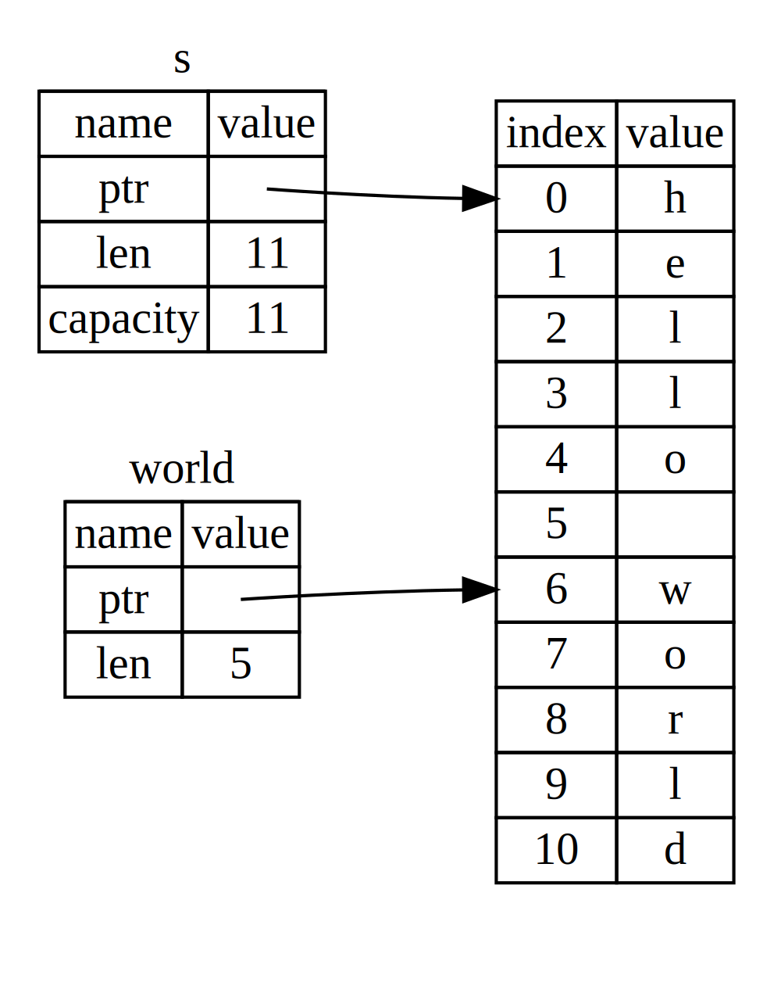

[toc]

#### 语句与表达式

Rust 的语法可以分成两大类：语句 Statement 和表达式 Expression 。语句是指 要执行的一些操作和产生副作用的表达式。表达式主要用于计算求值。 

语句又分为两种： 声明语句 Declaration statement 和 表达式语句 Expression statement 。声明语句，用于声明各种语言项 (Item ），包括声明变量、静态变量、常量 结构体、 函数等，以及通过 extern use 关键字引入包和模块等。 表达式语句，特指以分号结尾的表达式。此类表达式求值结果将会被舍弃 并总是返 回单元类型（）

Rust 编译器在解析代码的时候，如果碰到分号，就会继续往后面执行；如果碰到语旬， 则执行语句；如果碰到表达式，则会对表达式求值，如果分号后面什么都没有，就会补上单元值()。

当遇到函数的时候，会将函数体的花括号识别为块表达式（Block Expression ）。块表达式是由一对花括号和一系列表达式组成的，它总是返回块中最后一个表达式的值。

#### 变量&绑定

使用关键词 let 声明变量，变量的数据类型是从被分配的值而推断出来的，名称:类型的形式定义。let创建的变量一般称为绑定，它表明了标识符和值之间建立一种关联关系。

#### 位置表达式和值表达式

Rust 的表达式一般可以分为位置表达式 Place Expression ）和 值表达式 Value Expression ）。在其他语言中， 一般叫作左值 (LValue ）和右值（RValue）。

位置表达式就是表示内存位置的表达式。分别有以下几类

- 本地变量

- 静态变量

- 解引用（*expr）

- 数组索引（ expr[expr] ) 

- 字段引用（ expr.field) 

- 位置表达式组合

通过位置表达式可以对某个数据单元的内存进行读写。主要是进 写操作，这也是位置表达式可以被赋值的原因。

除此之外的表达式就是值表达式。值表达式一般只引用了某个存储单元地址中的数据它相当于数据值，只能进行读操作。

#### 可变绑定和不可变绑定

使用 let 关键字声明的位置表达式默认不可变，为不可变绑定。从语义上来说， 默认声明的不可变绑定只能对相应的存储单元进行读取，而 let mut 声明的可变绑定 是可以对相应的存储单元进行写入的。

#### 常量
Rust 有两种常量，可以在任意作用域声明，包括全局作用域。它们都需要显式的类型声明：

- `const`：不可改变的值（通常使用这种）
- `static`：具有 [`'static`](https://rustwiki.org/zh-CN/rust-by-example/scope/lifetime/static_lifetime.html) 生命周期的，可以是可变的变量，在she e

#### 隐藏
我们可以定义一个与之前变量同名的新变量，而新变量会隐藏之前的变量。并且新变量和旧变量可以不同类型。

#### 数据类型
在 Rust 中，每一个值都属于某一个数据类型（data type），们将看到两类数据类型子集：标量（scalar）和复合（compound）。标量（scalar）类型代表一个单独的值。Rust 有四种基本的标量类型：整型、浮点型、布尔类型和字符类型

复合类型（Compound types）可以将多个值组合成一个类型。Rust 有两个原生的复合类型：元组（tuple）和数组（array）。

#### 数组

数组是 Rust 内建的原始集合类型，数组的特点为

- 数组大小固定
- 元素均为同类型 
- 默认不可变。

数组的类型签名为［T:N]，T 是一个泛型标记表示数组中元素的某具体类，N 代表数组的长度，是一 编译时常量，必须在编译时确定其值。即使通过 let mut 关键宇定义可变绑定 mut arr ，也只能修改己存在于索号位上的元素。

数组中的每个元素的类型必须相同。Rust 中的数组与一些其他语言中的数组不同，因为 Rust 中的数组是固定长度的一旦声明，它们的长度不能增长或缩小。数组中的值位于中括号内的逗号分隔的列表中。

```rust
fn main() {
    let a = [1, 2, 3, 4, 5];
}
```
数组在栈（stack）而不是在堆（heap）上为数据分配空间，但是数组并不如 vector 类型灵活。vector 类型是标准库提供的一个 允许 增长和缩小长度的类似数组的集合类型。Rust 语言为数组的声明和初始化提供了 3 中语法
```rust
let arr1:[u32;4] = [1,2,3,4];
// 类型和长度可以省略
let arr2 = ["a","b","c"];
// 默认值初始化
let arr3 = [2;5];
```
因为数组的长度在编译时就时已知的，因此我们可以使用 for ... in 语句来遍历数组。
```rust
for index in 0..4 {
    println!("index is: {} & value is : {}",index,arr1[index]);
}
for val in arr1.iter(){
  println!("value is :{}",val);
}
```
数组可以作为函数的参数。而传递方式有 传值传递 和 引用传递 两种方式。传值传递 就是传递数组的一个副本给函数做参数，函数对副本的任何修改都不会影响到原来的数组。引用传递 就是传递数组在内存上的位置给函数做参数，因此函数对数组的任何修改都会影响到原来的数组。

```rust
fn main(){
    let mut arr3 = [0;2];
    println!("{}",arr3.len());
    for index in 0..2 {
        println!("index is: {} & value is : {}",index,arr3[index]);
    }
    change_arr(&mut arr3);
    for v in arr3.iter(){
        println!("{}",v);
    }
}
fn change_arr( arr: & mut [i32;2]) {
    arr[1] = 10;
}
```

#### 范围类型

Rust 内置了范围类型，包包左闭右开和全闭两种区间。

```rust
fn main() {
    for v in 1..4{
        println!("{}",v);
    }
    for v in 1..=4{
        println!("{}",v);
    }
    println!("{}",(1..3).start);
    println!("{}",(1..3).end);
}

```

#### 切片

切片 Slice 类型是对一数组（包括定大小数组和动态数组） 的引用片段，有利于安全有效地访数组的一部分，而不需要拷贝。因为理论上讲，切片引用的是已经存在的变量。在底层，切片代表一个指向数组起始位置的指针和数组长度。用 [T］类型表示连续序列， 那么切片类型就是＆ [T］和＆mut [T]。

```rust
fn main() {
    let arr = [1,2,3,4];
    assert_eq!(&arr[1..],[2,3,4]);
    assert_eq!(&arr[..],arr);
    println!("{}",(&arr[1..]).len())
}
```

#### str字符串

Rust 提供了 原始的字符串类型 str，也叫作字符串切片。它通常以不可变借用的形式存在， 即＆str 出于内存安全的考虑 Rust 将字符串分为两种类型，一种是固定长度字符串，不可随便更改其长 ，就 str 字符串 ，另一种是可增长字符串，可以随意改变其长度，就是 String 字符串。

```rust
fn main() {
    let s1 = "rust";
    let s2:& 'static str = "rust";
    let p = s2.as_ptr();
    let len = s1.len();
}
```


本质上，字符串字面量属于 str 类型，只不过它是静态生命周期字符串 &'static str。所谓静态生命周期，可以理解为该类型字符串和程序代码一样是持续有效。

str 字符串类型由两部分组成：指向字符串序列 的指针和记录长度的值。可以通过 str 模块提供的 as_ptr 和len 方法分别求得指针和长度。

**字符串 slice**（*string slice*）是 `String` 中一部分值的引用，因此它是没有所有权的类型。它是对部分 `String` 的引用。

```rust
#![allow(unused_variables)]
fn main() {
	let s = String::from("hello world");
	let hello = &s[0..5];
	let world = &s[6..11];
}
```

可以使用一个由中括号中的 `[starting_index..ending_index]` 指定的 range 创建一个 slice，其中 `starting_index` 是 slice 的第一个位置，`ending_index` 则是 slice 最后一个位置的后一个值。在其内部，slice 的数据结构存储了 slice 的开始位置和长度，长度对应于 `ending_index` 减去 `starting_index` 的值。所以对于 `let world = &s[6..11];` 的情况，`world` 将是一个包含指向 `s` 第 7 个字节（从 1 开始）的指针和长度值 5 的 slice。


其他用法如下所示，整体感觉和go的基本类似

```rust
let s = String::from("hello world");
let head = &s[..5];
let tail = &s[6..];
let all = &s[0..11];
let all_ = &s[..];
```

“字符串 slice” 的类型声明写作 `&str`，它是是一个不可变引用。字符串的字面值类型就是`&str`，它是一个指向二进制程序特定位置的 slice。这也就是为什么字符串字面值是不可变的。

#### 原生指针

我们将可以表示内存地址的类型称指针，Rust 提供了多 类型的指针，包括引用 Reference 、原生指针 Raw Pointer 、函数指针fn Pointer 和智能指针 Smart Pointer 。

引用它本质上非空指针，Rust 可以划 Safe Rust 和 Unsafe Rust 两部分，引用主要应用 Safe Rust 。在 Safe Rust 中， 编译器会对引用进行借用检查以保证内存安全和类型安全。

原生指针主要用于 Unsafe Rust 中，直接使用原生指针是不安全的。，比如原生指针可能指向一个NULL或者一个已经被释放的内存区域。因为使用原生指针的地方不在safe Rust的可控范围中，所以需要程序员保证内存安全。Rust支持两种原生指针：不可变原生指针* const T和可变原生指针 * mut T。

#### 元组

元组（ Tuple ）是 种异构有限序列，形如（M,N,T)。 所谓异构，就是指元组内的元素可以是不同类型的；所谓有限，是指元组有固定的长度。因为 let 支持模式匹配，所以可以用来解构元组。

```rust
fn main() {
    let t = (1,2,"a");
    assert_eq!(t.0,1);
    assert_eq!(t.2,"a");
    let tp = (4,);
    assert_eq!(t.0,4);
}
```


