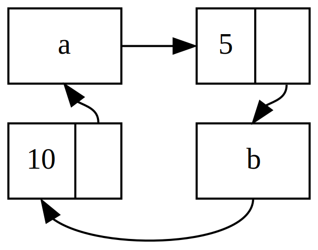

[toc]

#### Rc

大部分情况下所有权是非常明确的：可以准确地知道哪个变量拥有某个值。然而，有些情况单个值可能会有多个所有者。为了启用多所有权，Rust 有一个叫做 `Rc` 的类型。其名称为 **引用计数**（*reference counting*）的缩写。引用计数意味着记录一个值引用的数量来知晓这个值是否仍在被使用。如果某个值有零个引用，就代表没有任何有效引用并可以被清理。

`Rc` 用于当我们希望在堆上分配一些内存供程序的多个部分读取，而且无法在编译时确定程序的哪一部分会最后结束使用它的时候。如果确实知道哪部分是最后一个结束使用的话，就可以令其成为数据的所有者，正常的所有权规则就可以在编译时生效。注意 `Rc` 只能用于单线程场景。

列表 `a` 包含 5 之后是 10，之后是另两个列表：`b` 从 3 开始而 `c` 从 4 开始。`b` 和 `c` 会接上包含 5 和 10 的列表 `a`。换句话说，这两个列表会尝试共享第一个列表所包含的 5 和 10。

```RUST
enum List {
    Cons(i32, Box<List>),
    Nil,
}

use crate::List::{Cons, Nil};

fn main() {
    let a = Cons(5,
        Box::new(Cons(10,
            Box::new(Nil))));
    let b = Cons(3, Box::new(a));
    let c = Cons(4, Box::new(a));
}
```

`Cons` 成员拥有其储存的数据，所以当创建 `b` 列表时，`a` 被移动进了 `b` 这样 `b` 就拥有了 `a`。接着当再次尝使用 `a` 创建 `c` 时，这不被允许因为 `a` 的所有权已经被移动。

可以改变 `Cons` 的定义来存放一个引用，不过接着必须指定生命周期参数。通过指定生命周期参数，表明列表中的每一个元素都至少与列表本身存在的一样久。例如，借用检查器不会允许 `let a = Cons(10, &Nil);` 编译，因为临时值 `Nil` 会在 `a` 获取其引用之前就被丢弃了。

我们修改 `List` 的定义为使用 `Rc` 代替 `Box`。现在每一个 `Cons` 变量都包含一个值和一个指向 `List` 的 `Rc`。当创建 `b` 时，不同于获取 `a` 的所有权，这里会克隆 `a` 所包含的 `Rc`，这会将引用计数从 1 增加到 2 并允许 `a` 和 `b` 共享 `Rc` 中数据的所有权。创建 `c` 时也会克隆 `a`，这会将引用计数从 2 增加为 3。每次调用 `Rc::clone`，`Rc` 中数据的引用计数都会增加，直到有零个引用之前其数据都不会被清理。

```RUST
enum List {
    Cons(i32, Rc<List>),
    Nil,
}

use crate::List::{Cons, Nil};
use std::rc::Rc;

fn main() {
    let a = Rc::new(Cons(5, Rc::new(Cons(10, Rc::new(Nil)))));
    let b = Cons(3, Rc::clone(&a));
    let c = Cons(4, Rc::clone(&a));
}
```

也可以调用 `a.clone()` 而不是 `Rc::clone(&a)`，不过在这里 Rust 的习惯是使用 `Rc::clone`。`Rc::clone` 的实现并不像大部分类型的 `clone` 实现那样对所有数据进行深拷贝。`Rc::clone` 只会增加引用计数，这并不会花费多少时间。

```RUST
fn main() {
    let a = Rc::new(Cons(5, Rc::new(Cons(10, Rc::new(Nil)))));
    println!("count after creating a = {}", Rc::strong_count(&a));
    let b = Cons(3, Rc::clone(&a));
    println!("count after creating b = {}", Rc::strong_count(&a));
    {
        let c = Cons(4, Rc::clone(&a));
        println!("count after creating c = {}", Rc::strong_count(&a));
    }
    println!("count after c goes out of scope = {}", Rc::strong_count(&a));
}
```

`a` 中 `Rc` 的初始引用计数为1，接着每次调用 `clone`，计数会增加1。当 `c` 离开作用域时，计数减1。不必像调用 `Rc::clone` 增加引用计数那样调用一个函数来减少计数；`Drop` trait 的实现当 `Rc` 值离开作用域时自动减少引用计数。

#### Cell<T>

```rust
use std::cell::Cell;

fn main() {
    struct Foo{
        a:i32,
        b:Cell<i32>,
        c:Cell<String>
    }

    let f = Foo{
        a:10,
        b:Cell::new(20),
        c:Cell::new("c".to_string())
    };
    assert_eq!(20,f.b.get());
    f.b.set(30);
    assert_eq!(30,f.b.get());
    //assert_eq!("c",f.c.get_mut())
}
```

Cell <T>内部可变容器确实方便了编程。它提供的 set/get，对于包裹在 Cell<T>中的类型只有实现了 Copy 类型 T，才可以使用 get方法获取包裹的值，，因为 get 方法返回的是对内部值的复制。但是任何类型T都可以使用 set 方法修改 其包裹的值。

对于实现 copy 的类型可以任意读取，对于没有实现 Copy 的类型T，则提供了 get_mut 方法来返回可变借用。

#### RefCell<T>

对于没有实现 Copy 类型 使用 Cell <T>有许多不便 ，Rust 提供的 RefCell<T>适用的范围更广，RefCell<T>提供了 borrow/borrow_mut方法对应Cell的 get/set 方法。

-  Cell<T>使用 set/get 方法直接操作包裹的值， RefCell<T>通过 borrow/borrow_mut 返回包装过的引用 Ref<T>和 RefMut<T>来操作包裹的值。

- Cell<T>一般适合复制语义类型(实现了 Copy), RefCel<T>一般适合移动语义类型(未实现 Copy)。
- Cell<T>无运行时开销，并且永远不会在运行时引发 panic 错 误。 RefCell<T>需要在运行时执行借用检查，所以有运行时开销，一旦发现违反借用规则的情况，则会引发线程 panic 而退出 当前线程。

对于引用和 `Box<T>`，借用规则的不可变性作用于编译时。对于 `RefCell<T>`，这些不可变性作用于 **运行时**。对于引用，如果违反这些规则，会得到一个编译错误。而对于 `RefCell<T>`，如果违反这些规则程序会 panic 并退出。

#### 不可变值的可变借用

借用规则的一个推论是当有一个不可变值时，不能可变地借用它。例如，如下代码不能编译：

```rust
fn main() {
    let x = 5;
    let y = &mut x;
}
```

然而，特定情况下在值的方法内部能够修改自身是很有用的，而不是在其他代码中。此时值仍然是不可变的，值方法外部的代码不能修改其值。`RefCell<T>` 是一个获得内部可变性的方法。`RefCell<T>` 并没有完全绕开借用规则，编译器中的借用检查器允许内部可变性并相应地在运行时检查借用规则。如果违反了这些规则，会得到 `panic!` 而不是编译错误。

```rust
let x = RefCell::new(5);
*(x.borrow_mut()) = 20;
println!("{:?}", x)
```

当创建不可变和可变引用时，我们分别使用 `&` 和 `&mut` 语法。对于 `RefCell<T>` 来说，则是 `borrow` 和 `borrow_mut` 方法，这属于 `RefCell<T>` 安全 API 的一部分。`borrow` 方法返回 `Ref` 类型的智能指针，`borrow_mut` 方法返回 `RefMut` 类型的智能指针。这两个类型都实现了 `Deref`，所以可以当作常规引用对待。

`RefCell<T>` 记录当前有多少个活动的 `Ref<T>` 和 `RefMut<T>` 智能指针。每次调用 `borrow`，`RefCell<T>` 将活动的不可变借用计数加一。当 `Ref` 值离开作用域时，不可变借用计数减一。就像编译时借用规则一样，`RefCell<T>` 在任何时候只允许有多个不可变借用或一个可变借用。

#### `Rc<T>` 和 `RefCell<T>`

`Rc<T>` 允许对相同数据有多个所有者，不过只能提供数据的不可变访问。如果有一个储存了 `RefCell<T>` 的 `Rc<T>` 的话，就可以得到有多个所有者 **并且** 可以修改的值了！

使用 `Rc<T>` 使得多个列表共享另一个列表的所有权。因为 `Rc<T>` 只存放不可变值，所以一旦创建了这些列表值后就不能修改。让我们加入 `RefCell<T>` 来获得修改列表中值的能力。

```rust
#[derive(Debug)]
enum List {
    Cons(Rc<RefCell<i32>>, Rc<List>),
    Nil,
}
use std::rc::Rc;
use std::cell::RefCell;

fn main() {
    let value = Rc::new(RefCell::new(5));

    let a = Rc::new(List::Cons(Rc::clone(&value), Rc::new(List::Nil)));

    let b = List::Cons(Rc::new(RefCell::new(6)), Rc::clone(&a));
    let c = List::Cons(Rc::new(RefCell::new(10)), Rc::clone(&a));

    *value.borrow_mut() += 10;

    println!("a after = {:?}", a);
    println!("b after = {:?}", b);
    println!("c after = {:?}", c);
}
```

这里创建了一个 `Rc<RefCell<i32>>` 实例并储存在变量 `value` 中以便之后直接访问。接着在 `a` 中用包含 `value` 的 `Cons` 成员创建了一个 `List`。需要克隆 `value` 以便 `a` 和 `value` 都能拥有其内部值 `5` 的所有权，而不是将所有权从 `value` 移动到 `a` 或者让 `a` 借用 `value`。

#### 循环引用

与在编译时拒绝数据竞争不同， Rust 并不保证完全地避免内存泄露，这意味着内存泄露在 Rust 被认为是内存安全的。这一点可以通过 `Rc<T>` 和 `RefCell<T>` 看出：创建引用循环的可能性是存在的。这会造成内存泄露，因为每一项的引用计数永远也到不了 0，其值也永远也不会被丢弃。

```rust
use std::rc::Rc;
use std::cell::RefCell;

#[derive(Debug)]
enum List {
    Cons(i32, RefCell<Rc<List>>),
    Nil,
}

impl List {
    fn next(&self) -> Option<&RefCell<Rc<List>>> {
        match self {
            List::Cons(_, item) => Some(item),
            Nil => None,
        }
    }
}
fn main() {
    let a = Rc::new(List::Cons(5, RefCell::new(Rc::new(List::Nil))));

    println!("a initial rc count = {}", Rc::strong_count(&a));
    println!("a next item = {:?}", a.next());

    let b = Rc::new(List::Cons(10, RefCell::new(Rc::clone(&a))));

    println!("a rc count after b creation = {}", Rc::strong_count(&a));
    println!("b initial rc count = {}", Rc::strong_count(&b));
    println!("b next item = {:?}", b.next());

    if let Some(link) = a.next() {
        *link.borrow_mut() = Rc::clone(&b);
    }

    println!("b rc count after changing a = {}", Rc::strong_count(&b));
    println!("a rc count after changing a = {}", Rc::strong_count(&a));
    // it will overflow the stack
    // println!("a next item = {:?}", a.tail());
}
```


这里在变量 `a` 中创建了一个 `Rc<List>` 实例来存放初值为 `5, Nil` 的 `List` 值。接着在变量 `b` 中创建了存放包含值 10 和指向列表 `a` 的 `List` 的另一个 `Rc<List>` 实例。

最后，修改 `a` 使其指向 `b` 而不是 `Nil`，这就创建了一个循环。为此需要使用 next 方法获取 `a` 中 `RefCell<Rc<List>>` 的引用，并放入变量 `link` 中。接着使用 `RefCell<Rc<List>>` 的 `borrow_mut` 方法将其值从存放 `Nil` 的 `Rc` 修改为 `b` 中的 `Rc<List>`。



如果取消最后 `println!` 的注释并运行程序，Rust 会尝试打印出 `a` 指向 `b` 指向 `a` 这样的循环直到栈溢出。

#### Weak<T>

调用 `Rc::clone` 会增加 `Rc` 实例的 `strong_count`，和只在其 `strong_count` 为 0 时才会被清理的 `Rc` 实例。调用 `Rc::downgrade` 并传递 `Rc` 实例的引用来创建其值的 **弱引用**（*weak reference*）。调用 `Rc::downgrade` 时会得到 `Weak` 类型的智能指针。不同于将 `Rc` 实例的 `strong_count` 加1，调用 `Rc::downgrade` 会将 `weak_count` 加1。`Rc` 类型使用 `weak_count` 来记录其存在多少个 `Weak` 引用，类似于 `strong_count`。其区别在于 `weak_count` 无需计数为 0 就能使 `Rc` 实例被清理。

强引用代表如何共享 `Rc` 实例的所有权，但弱引用并不属于所有权关系。他们不会造成引用循环，因为任何弱引用的循环会在其相关的强引用计数为 0 时被打断。

强引用代表如何共享 `Rc` 实例的所有权，但弱引用并不属于所有权关系。他们不会造成引用循环，因为任何弱引用的循环会在其相关的强引用计数为 0 时被打断。

因为 `Weak` 引用的值可能已经被丢弃了，为了使用 `Weak` 所指向的值，我们必须确保其值仍然有效。为此可以调用 `Weak` 实例的 `upgrade` 方法，这会返回 `Option>`。如果 `Rc` 值还未被丢弃，则结果是 `Some`；如果 `Rc` 已被丢弃，则结果是 `None`。因为 `upgrade` 返回一个 `Option`，我们确信 Rust 会处理 `Some` 和 `None` 的情况，所以它不会返回非法指针。

我们构建一个带有子节点的树。让我们创建一个用于存放其拥有所有权的 `i32` 值和其子节点引用的 `Node`：

```rust
struct Node {
    value: i32,
    children: RefCell<Vec<Rc<Node>>>,
}
```

我们希望能够 `Node` 拥有其子结点，同时也希望通过变量来共享所有权，以便可以直接访问树中的每一个 `Node`，为此 `Vec` 的项的类型被定义为 `Rc`。我们还希望能修改其他结点的子结点，所以 `children` 中 `Vec>` 被放进了 `RefCell`

接下来，使用此结构体定义来创建一个叫做 `leaf` 的带有值 3 且没有子结点的 `Node` 实例，和另一个带有值 5 并以 `leaf` 作为子结点的实例 `branch`

```rust
    let leaf = Rc::new(Node {
        value: 3,
        children: RefCell::new(vec![]),
    });

    let branch = Rc::new(Node {
        value: 5,
        children: RefCell::new(vec![Rc::clone(&leaf)]),
    });
```

这里克隆了 `leaf` 中的 `Rc` 并储存在了 `branch` 中，这意味着 `leaf` 中的 `Node` 现在有两个所有者：`leaf`和`branch`。可以通过 `branch.children` 从 `branch` 中获得 `leaf`，不过无法从 `leaf` 到 `branch`。

为了使子结点知道其父结点，需要在 `Node` 结构体定义中增加一个 `parent` 字段。问题是 `parent` 的类型应该是什么。我们知道其不能包含 `Rc`，因为这样 `leaf.parent` 将会指向 `branch` 而 `branch.children` 会包含 `leaf` 的指针，这会形成引用循环，会造成其 `strong_count` 永远也不会为 0.

父结点应该拥有其子结点：如果父结点被丢弃了，其子结点也应该被丢弃。然而子结点不应该拥有其父结点：如果丢弃子结点，其父结点应该依然存在。这正是弱引用的例子。所以 `parent` 使用 `Weak` 类型而不是 `Rc`，具体来说是 `RefCell>`。

```RUST
struct Node {
    value: i32,
    parent: RefCell<Weak<Node>>,
    children: RefCell<Vec<Rc<Node>>>,
}
```

这样，一个结点就能够引用其父结点，但不拥有其父结点。

```RUST
fn main() {
    let leaf = Rc::new(Node {
        value: 3,
        parent: RefCell::new(Weak::new()),
        children: RefCell::new(vec![]),
    });

    println!("leaf parent = {:?}", leaf.parent.borrow().upgrade());

    let branch = Rc::new(Node {
        value: 5,
        parent: RefCell::new(Weak::new()),
        children: RefCell::new(vec![Rc::clone(&leaf)]),
    });

    *leaf.parent.borrow_mut() = Rc::downgrade(&branch);

    println!("leaf parent = {:?}", leaf.parent.borrow().upgrade());
}
```

当创建 `branch` 结点时，其也会新建一个 `Weak` 引用，因为 `branch` 并没有父结点。`leaf` 仍然作为 `branch` 的一个子结点。一旦在 `branch` 中有了 `Node` 实例，就可以修改 `leaf` 使其拥有指向父结点的 `Weak` 引用。这里使用了 `leaf` 中 `parent` 字段里的 `RefCell>` 的 `borrow_mut` 方法，接着使用了 `Rc::downgrade` 函数来从 `branch` 中的 `Rc` 值创建了一个指向 `branch` 的 `Weak` 引用。

#### 再谈Weak<T>

```rust
use std::cell::RefCell;
use std::rc::{Weak, Rc};

#[derive(Debug)]
struct Node {
    value: i32,
    parent: RefCell<Weak<Node>>,
    children: RefCell<Vec<Rc<Node>>>,
}

fn main() {
    let leaf = Rc::new(Node {
        value: 3,
        parent: RefCell::new(Weak::new()),
        children: RefCell::new(vec![]),
    });
    println!(
        "leaf strong = {}, weak = {}",
        Rc::strong_count(&leaf),
        Rc::weak_count(&leaf),
    );

    {
        let branch = Rc::new(Node {
            value: 5,
            parent: RefCell::new(Weak::new()),
            children: RefCell::new(vec![Rc::clone(&leaf)]),
        });

        *leaf.parent.borrow_mut() = Rc::downgrade(&branch);

        println!(
            "branch strong = {}, weak = {}",
            Rc::strong_count(&branch),
            Rc::weak_count(&branch),
        );

        println!(
            "leaf strong = {}, weak = {}",
            Rc::strong_count(&leaf),
            Rc::weak_count(&leaf),
        );
    }

    println!("leaf parent = {:?}", leaf.parent.borrow().upgrade());
    println!(
        "leaf strong = {}, weak = {}",
        Rc::strong_count(&leaf),
        Rc::weak_count(&leaf),
    );
}

```

一旦创建了 `leaf`，其 `Rc` 的强引用计数为 1，弱引用计数为 0。在内部作用域中创建了 `branch` 并与 `leaf` 相关联，此时 `branch` 中 `Rc` 的强引用计数为 1，弱引用计数为 1（因为 `leaf.parent` 通过 `Weak` 指向 `branch`）。这里 `leaf` 的强引用计数为 2，因为现在 `branch` 的 `branch.children` 中储存了 `leaf` 的 `Rc` 的拷贝，不过弱引用计数仍然为 0。

当内部作用域结束时，`branch` 离开作用域，`Rc` 的强引用计数减少为 0，所以其 `Node` 被丢弃。来自 `leaf.parent` 的弱引用计数 1 与 `Node` 是否被丢弃无关，所以并没有产生任何内存泄露！

如果在内部作用域结束后尝试访问 `leaf` 的父结点，会再次得到 `None`。在程序的结尾，`leaf` 中 `Rc` 的强引用计数为 1，弱引用计数为 0，因为现在 `leaf` 又是 `Rc` 唯一的引用了。

所有这些管理计数和值的逻辑都内建于 `Rc` 和 `Weak` 以及它们的 `Drop` trait 实现中。通过在 `Node` 定义中指定从子结点到父结点的关系为一个`Weak`引用，就能够拥有父结点和子结点之间的双向引用而不会造成引用循环和内存泄露。

#### 总结

1. `Box<T>` 是一种独享所有权智能指针，资源分配在堆上，依靠`Deref`和`Drop`来管理堆上的资源，零运行时开销。
   - Box::new(v) ： 创建，移动语义，独占所有权 - `move`，`允许`使用`*`转移本体所有权
   - 不可变借用：Box::borrow()、Box::as_ref()、Box::deref()
   - 可变借用：Box::borrow_mut()、Box::as_mut()、Box::deref_mut()
2. `Rc<T>`是一种共享所有权智能指针，资源分配在堆上，依靠`Deref`和`Drop`来管理堆上的资源，使用引用计数算法。
   - Rc::new(v) ： 创建，移动语义，共享所有权 - `clone`，`禁止`使用`*`转移本体所有权
   - 不可变借用：Rc::borrow()、Rc::as_ref()、Rc::deref()
   - 可变借用：Rc::borrow_mut()、Rc::as_mut()、Rc::deref_mut()
3. `Arc<T>`是一种线程安全的共享所有权智能指针，资源分配在堆上，依靠`Deref`和`Drop`来管理堆上的资源，使用引用计数算法。
   - Arc::new(v) ： 创建，移动语义，共享所有权 - clone，禁止使用*转移本体所有权
   - 不可变借用：Arc::borrow()、Arc::as_ref()、Arc::deref()
   - 可变借用：Arc::borrow_mut()、Arc::as_mut()、Arc::deref_mut()
4. `Cell<T>`是一种提供`内部可变性`的容器，适合实现了Copy的类型，或者体积小的struct，因为get方法是直接按位复制的。
   无运行时开销，运行时安全。
   - Cell::new(v) ： 创建，移动语义
   - 获取本体v：Cell::get()
   - 获取本体借用&v：Cell::get_mut()
   - 修改本体v：Cell::set(vv)
5. `RefCell<T>`是一种提供`内部可变性`的容器，适合未实现了Copy的类型，或者体积大的struct，Cell不好使的都是用这个。
   运行时有开销，会执行借用检查，运行时不安全。
   - RefCell::new(v) ： 创建，移动语义
   - 不可变借用：RefCell::borrow()、类似Cell::get
   - 可变借用：RefCell::borrow_mut()、类似Cell::set
6. `Cow<T>`是一种`写时复制`的枚举体的智能指针，目的是减少复制操作，提高性能，多用于读多写少的场景。
   - Cow::Borrowed(v) | Cow::Owned(v) ： 创建，移动语义
   - 不可变借用：Cow::deref()，Owned会调用borrow返回，Borrowed直接返回
   - 可变借用：Cow::to_mut()，Borrowed会调用clone替换自己为Owned，然后Owned会匹配ref mut释放借用。
     获得本体：Cow::into_owned()，Borrowed会调用clone后返回，Owned会把自己返回。