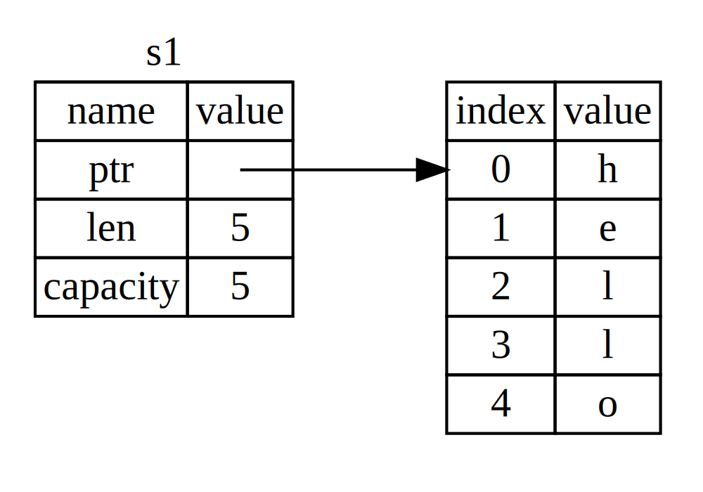
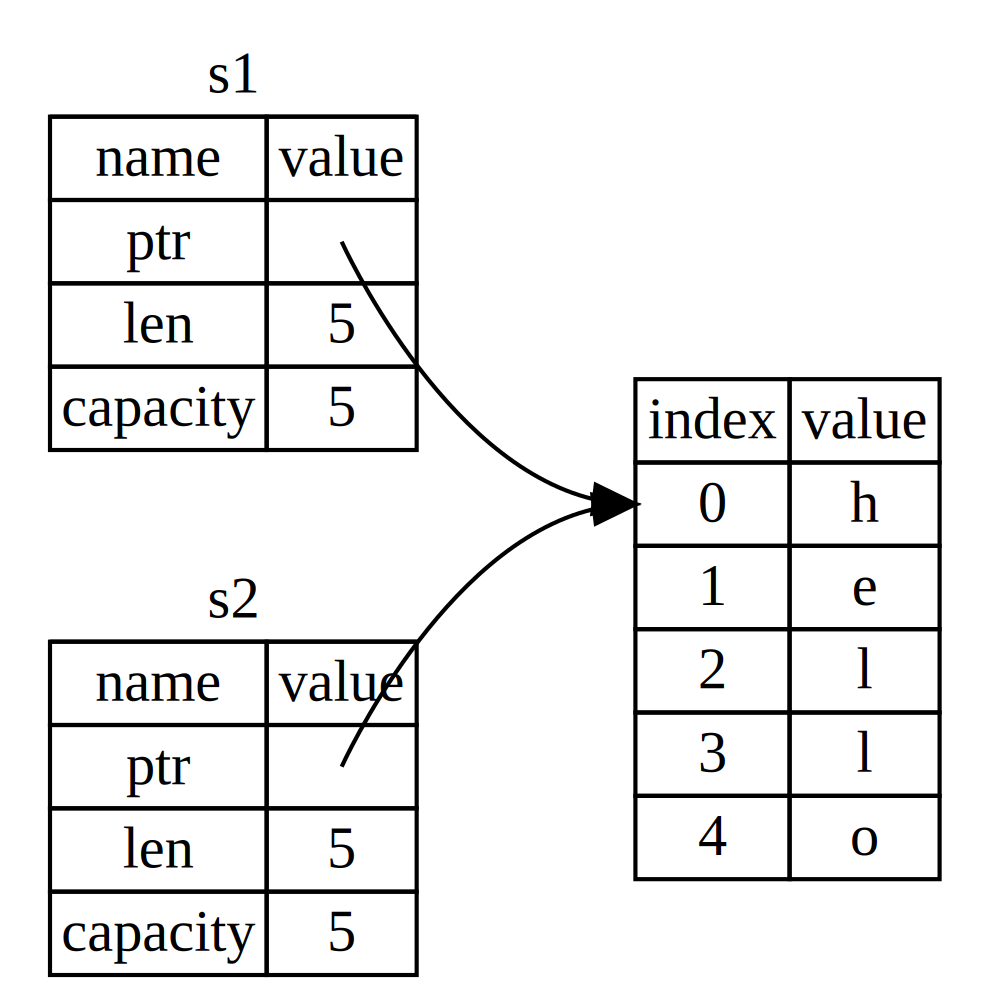
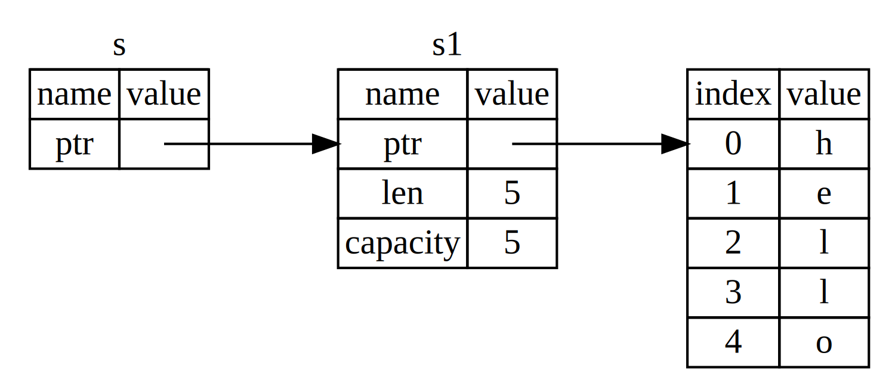

[toc]

#### 栈（Stack）与堆（Heap）

栈和堆都是代码在运行时可供使用的内存，但是它们的结构不同。栈以放入值的顺序存储值并以相反顺序取出值。这也被称作后进先出，增加数据叫做 进栈（pushing onto the stack），而移出数据叫做出栈。栈的操作是十分快速的，这主要是得益于它存取数据的方式：因为数据存取的位置总是在栈顶而不需要寻找一个位置存放或读取数据。另一个让操作栈快速的属性是，栈中的所有数据都必须占用已知且固定的大小。

在编译时大小未知或大小可能变化的数据，要改为存储在堆上。堆是缺乏组织的：当向堆放入数据时，你要请求一定大小的空间。操作系统在堆的某处找到一块足够大的空位，把它标记为已使用，并返回一个表示该位置地址的 指针（pointer）。这个过程称作 在堆上分配内存。

当你的代码调用一个函数时，传递给函数的值（包括可能指向堆上数据的指针）和函数的局部变量被压入栈中。当函数结束时，这些值被移出栈。

#### 所有权规则
1. Rust 中的每一个值都有一个被称为其 所有者（owner）的变量。
2. 值有且只有一个所有者。
3. 当所有者（变量）离开作用域，这个值将被丢弃。

#### 变量作用域
作用域是一个变量在程序中有效的范围。假设有这样一个变量：

```rust
{
	let s = "hello";
}	 // 此作用域已结束，s 不再有效
```

变量 `s` 绑定到了一个字符串字面值，这个字符串值是硬编码进程序代码中的。这个变量从声明的点开始直到当前 **作用域** 结束时都是有效的

换句话说，这里有两个重要的时间点：

- 当 `s` **进入作用域** 时，它就是有效的。
- 这一直持续到它 **离开作用域** 为止。

#### 内存分配

对于 `String` 类型，为了支持一个可变，可增长的文本片段，需要在堆上分配一块在编译时未知大小的内存来存放内容。这意味着：

- 必须在运行时向操作系统请求内存。
- 需要一个当我们处理完 `String` 时将内存返回给操作系统的方法。

第一部分由我们完成：当调用 `String::from` 时，它的实现 (*implementation*) 请求其所需的内存。这在编程语言中是非常通用的。

然而，第二部分实现起来就各有区别了。在有 **垃圾回收**（*garbage collector*，*GC*）的语言中， GC 记录并清除不再使用的内存，而我们并不需要关心它。没有 GC 的话，识别出不再使用的内存并调用代码显式释放就是我们的责任了，跟请求内存的时候一样。Rust 采取了一个不同的策略：内存在拥有它的变量离开作用域后就被自动释放。

```rust
{
    let s = String::from("hello"); // 从此处起，s 是有效的

    // 使用 s
}  // 此作用域已结束,s不再有效
```

这是一个将 `String` 需要的内存返回给操作系统的很自然的位置：当 `s` 离开作用域的时候。当变量离开作用域，Rust 为我们调用一个特殊的函数。这个函数叫做 `drop`，在这里 `String` 的作者可以放置释放内存的代码。Rust 在结尾的 `}` 处自动调用 `drop`。

#### 移动

下来看一个整数的例子

```rust
let x = 5;
let y = x;
```

将 `5` 绑定到 `x`，接着生成一个值 `x` 的拷贝并绑定到 `y`。现在有了两个变量，`x` 和 `y`，都等于 `5`。整数是有已知固定大小的简单值，所以这两个 `5` 被放入了栈中。

现在看看这个 `String` 版本：

```rust
let s1 = String::from("hello");
let s2 = s1;
println!("{}{}",s1,s2)
```

事实上并不会像整数那样进行拷贝，先来了解下String的内存结构，`String` 由三部分组成，如图左侧所示：一个指向存放字符串内容内存的指针，一个长度，和一个容量。这一组数据存储在栈上。右侧则是堆上存放内容的内存部分。



长度表示 `String` 的内容当前使用了多少字节的内存。容量是 `String` 从操作系统总共获取了多少字节的内存。当我们将 `s1` 赋值给 `s2`，`String` 的数据被复制了，这意味着我们从栈上拷贝了它的指针、长度和容量。我们并没有复制指针指向的堆上数据。



之前我们提到过当变量离开作用域后，Rust 自动调用 `drop` 函数并清理变量的堆内存。不过上图展示了两个数据指针指向了同一位置。这就有了一个问题：当 `s2` 和 `s1` 离开作用域，他们都会尝试释放相同的内存。这是一个叫做 **二次释放**（*double free*）的错误，两次释放（相同）内存会导致内存污染，它可能会导致潜在的安全漏洞。

与其尝试拷贝被分配的内存，Rust 则认为 `s1` 不再有效，这个操作被称为 **移动**（*move*）,即`s1`指向的变量所有权移动至`s2`中。因此 Rust 不需要在 `s1` 离开作用域后清理任何东西。当`s2`创建后再使用`s1`会产生一个无效引用的错误。因为只有 `s2` 是有效的，当其离开作用域，它就释放自己的内存。

在语义上，每个变量绑定实际上都拥有该存储单元的所有权 这种转移内存地址的行为 就是所有权（OwnerShip ）的转移，在 Rust 中称为移动（ Move ）语义，那种不转移的情况 实际上是一种复制（ Copy) 语义 ，rust没有 GC ，所以完全依靠所有权来进行内存管理。

有时候并不需要转移所有权。 Rust提供引用操作符 &， 可以直接获取表达式的存储单元地址，即内存位置。可通过该内存位置对存储进行读取。

#### 克隆

如果我们 **确实** 需要深度复制 `String` 中堆上的数据，而不仅仅是栈上的数据，可以使用一个叫做 `clone` 的通用函数。像整型这样的在编译时已知大小的类型被整个存储在栈上，所以拷贝其实际的值是快速的。这意味着没有理由在创建变量 `y` 后使 `x` 无效。换句话说，这里没有深浅拷贝的区别，所以这里调用 `clone` 并不会与通常的浅拷贝有什么不同

#### 只在栈上的数据-拷贝

但这段代码似乎与我们刚刚学到的内容相矛盾：没有调用 `clone`，不过 `x` 依然有效且没有被移动到 `y` 中。

```rust
let x = 5;
let y = x;
println!("x = {}, y = {}", x, y);
```

原因是像整型这样的在编译时已知大小的类型被整个存储在栈上，所以拷贝其实际的值是快速的。这意味着没有理由在创建变量 `y` 后使 `x` 无效。

Rust 有一个叫做 `Copy` trait 的特殊注解，可以用在类似整型这样的存储在栈上的类型上。如果一个类型拥有 `Copy` trait，一个旧的变量在将其赋值给其他变量后仍然可用。Rust 不允许自身或其任何部分实现了 `Drop` trait 的类型使用 `Copy` trait。如果我们对其值离开作用域时需要特殊处理的类型使用 `Copy` 注解，将会出现一个编译时错误。

任何简单标量值的组合可以是 `Copy` 的，不需要分配内存或某种形式资源的类型是 `Copy` 的。如下是一些 `Copy` 的类型：

- 所有整数类型，比如 `u32`。
- 布尔类型，`bool`，它的值是 `true` 和 `false`。
- 所有浮点数类型，比如 `f64`。
- 字符类型，`char`。
- 元组，当且仅当其包含的类型也都是 `Copy` 的时候。比如，`(i32, i32)` 是 `Copy` 的，但 `(i32, String)` 就不是。

#### 所有权和函数

将值传递给函数在语义上与给变量赋值相似。向函数传递值可能会移动或者复制，就像赋值语句一样。

```rust
fn test_fn() {
    let s = String::from("hello");  // s 进入作用域

    takes_ownership(s);  // s 的值移动到函数里
    // s 到这里不再有效

    let x = 5;                 // x 进入作用域

    makes_copy(x);      // x 应该移动函数里，
    // 但 i32 是 Copy 的，所以在后面可继续使用 x

    // 这里x 先移出了作用域，然后是 s。但因为 s 的值已被移走，
    // 所以不会有特殊操作
}

fn takes_ownership(some_string: String) { // some_string 进入作用域
    println!("{}", some_string);
} // 这里，some_string 移出作用域并调用 `drop` 方法。占用的内存被释放

fn makes_copy(some_integer: i32) { // some_integer 进入作用域
    println!("{}", some_integer);
} // 这里，some_integer 移出作用域。不会有特殊操作
```


#### 返回值与作用域

变量的所有权总是遵循相同的模式：将值赋给另一个变量时移动它。当持有堆中数据值的变量离开作用域时，其值将通过 `drop` 被清理掉，除非数据被移动为另一个变量所有。同时返回值也可以转移所有权。

```rust
fn test_move_fn() {
    let s1 = gives_ownership();                 // gives_ownership 将返回值移给 s1

    let s2 = String::from("hello");             // s2 进入作用域

    let s3 = takes_and_gives_back(s2);  // s2 被移动到 takes_and_gives_back 中,
                                                // 它也将返回值移给 s3
} // 这里, s3 移出作用域并被丢弃。s2 也移出作用域，但已被移走，所以什么也不会发生
//s1 移出作用域并被丢弃

fn gives_ownership() -> String {             // gives_ownership 将返回值移动给调用它的函数

    let some_string = String::from("hello"); // some_string 进入作用域.

    some_string                              // 返回 some_string 并移出给调用的函数
}

// takes_and_gives_back 将传入字符串并返回该值
fn takes_and_gives_back(a_string: String) -> String { // a_string 进入作用域

    a_string                                          // 返回 a_string 并移出给调用的函数
}
```

在每一个函数中都获取所有权并接着返回所有权有些繁琐，Rust 对此提供了一个功能，叫做 **引用**（*references*）。

#### 引用和借用

& 符号表示 **引用**，它们允许你使用值但不获取其所有权。&String s` 指向 `String s1如下图所示：



看下面代码

```rust
fn ref_test() {
    let s1 = String::from("hello");
    let len = calculate_length(&s1);
    println!("The length of '{}' is {}.", s1, len);
}
fn calculate_length(s: &String) -> usize {
    s.len()
}
```

`&s1` 语法让我们创建一个 **指向** 值 `s1` 的引用，但是并不拥有它。因为并不拥有这个值，当引用离开作用域时其指向的值也不会被丢弃。因为我们没有所有权。当函数使用引用而不是实际值作为参数，无需返回值来交还所有权，因为就不曾拥有所有权。我们将获取引用作为函数参数称为 **借用**（*borrowing*）。

#### 可变引用

如果修改引用的参数，下列代码会编译会报错

```rust

fn change_test() {
    let s = String::from("hello");
    change(&s);
}
fn change(s: &String) {
    s.push_str(", world");
}
```

为什么呢？正如变量默认是不可变的，引用也一样。默认不允许修改引用的值。将 `s` 改为 `mut`。然后创建一个可变引用 `&mut s` 和接受一个可变引用s: & mut String。

```rust
fn change_test() {
    let mut s = String::from("hello");
    change(& mut s);
}
fn change(s: & mut String) {
    s.push_str(", world");
}
```

可变引用有一个很大的限制，在特定作用域中的特定数据有且只有一个可变引用。

```rust
	  let mut s = String::from("hello");
    let r1 = &mut s;
    let r2 = &mut s;
    println!("{}, {}", r1, r2);
```

此代码会编译失败，因为`r1`已是无效引用。我们 也不能在拥有不可变引用的同时拥有可变引用

#### 垂悬引用

在具有指针的语言中，很容易通过释放内存时保留指向它的指针而错误地生成一个 **悬垂指针**（*dangling pointer*），悬垂指针是其指向的内存可能已经被分配给其它持有者。相比之下，在 Rust 中编译器确保引用永远也不会变成悬垂状态：当你拥有一些数据的引用，编译器确保数据不会在其引用之前离开作用域。

```rust
fn dangling() {
    let reference_to_nothing = dangle();
}
fn dangle() -> &String {
    let s = String::from("hello");
    &s
}
```

这里编译会产生错误，因为 `s` 是在 `dangle` 函数内创建的，当 `dangle` 的代码执行完毕后，`s` 将被释放。不过我们尝试返回它的引用。这意味着这个引用会指向一个无效的 `String`，Rust 不会允许我们这么做。解决方法是直接返回 `String`。