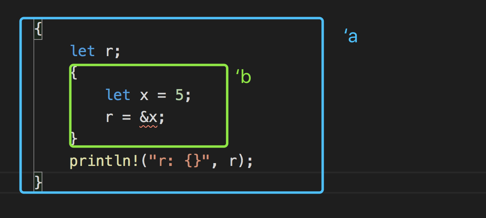

[toc]

Rust 中的每一个引用都有其 **生命周期**（*lifetime*），也就是引用保持有效的作用域。

####  避免垂悬引用

生命周期的主要目标是避免悬垂引用，它会导致程序引用了非预期引用的数据。

```rust
{
    let r;
    {
        let x = 5;
        r = &x;
    }
    println!("r: {}", r);
}
```

外部作用域声明了一个没有初值的变量 `r`，而内部作用域声明了一个初值为 5 的变量`x`。在内部作用域中，我们尝试将 `r` 的值设置为一个 `x` 的引用。接着在内部作用域结束后，尝试打印出 `r` 的值。这段代码不能编译因为 `r` 引用的值在尝试使用之前就离开了作用域。

如果 Rust 允许这段代码工作，`r` 将会引用在 `x` 离开作用域时被释放的内存，这时尝试对 `r` 做任何操作都不能正常工作。那么 Rust 是如何决定这段代码是不被允许的呢？这得益于借用检查器。Rust 编译器有一个 **借用检查器**（*borrow checker*），它比较作用域来确保所有的借用都是有效的。

r和x的生命周期如下图所示



这里将 `r` 的生命周期标记为 `'a` 并将 `x` 的生命周期标记为 `'b`。内部的 `'b` 块要比外部的生命周期 `'a` 小得多。在编译时，Rust 比较这两个生命周期的大小，并发现 `r` 拥有生命周期 `'a`引用了一个拥有生命周期 `'b` 的对象。程序被拒绝编译，因为生命周期 `'b` 比生命周期 `'a` 要小：被引用的对象比它的引用者存在的时间更短。

改为下面代码即可以通过编译

```rust
{
    let r;
    let x = 5;
    r = &x;
    println!("r: {}", r);
}
```

这里r和x的生命周期相同，r中的引用在x有效时总是也总是有效的。

#### 函数生命周期

这个函数获取两个字符串 slice 并返回一个字符串 slice，因为我们不希望 `longest` 函数获取参数的所有权。我们期望该函数接受 `String` 的 slice。但是这段代码不能通过编译。

```rust
fn longest(x: &str, y: &str) -> &str {
    if x.len() > y.len() {
        x
    } else {
        y
    }
}
```

当我们定义这个函数的时候，并不知道传递给函数的具体值，所以也不知道到底是 `if` 还是 `else` 会被执行。我们也不知道传入的引用的具体生命周期，所以也就不能像前面的示例那样通过观察作用域来确定返回的引用是否总是有效。借用检查器自身同样也无法确定，因为它不知道 `x` 和 `y` 的生命周期是如何与返回值的生命周期相关联的。

为了修复这个错误，我们将增生命周期注解来定义引用间的关系以便`借用检查器`可以进行分析。生命周期注解也称作泛型生命周期。

生命周期注解并不改变任何引用的生命周期的长短。与当函数签名中指定了泛型类型参数后就可以接受任何类型一样，当指定了泛型生命周期后函数也能接受任何生命周期的引用。生命周期注解描述了多个引用生命周期相互的关系，而不影响其生命周期。

```rust
fn longest<'a>(x: &'a str, y: &'a str) -> &'a str {
    if x.len() > y.len() {
        x
    } else {
        y
    }
}
```

函数定义指定入参和返回值所有的引用必须有相同的生命周期 `'a`，继续看我们的调用方式

```rust
fn main() {
    let string1 = String::from("long string is long");

    {
        let string2 = String::from("xyz");
        let result = longest(string1.as_str(), string2.as_str());
        println!("The longest string is {}", result);
    }
}
```

在这个例子中，`string1` 直到外部作用域结束都是有效的，`string2` 则在内部作用域中是有效的，而 `result` 则引用了一些直到内部作用域结束都是有效的值。

看另外一种调用方式

```rust
fn main() {
    let string1 = String::from("long string is long");
    let result;
    {
        let string2 = String::from("xyz");
        result = longest(string1.as_str(), string2.as_str());
    }
    println!("The longest string is {}", result);
}
```

这种方式编译不能通过，尽管result引用指向string1，但是编译器不这么认为，因为我们通过生命周期注解告诉编译器函数返回引用的生命周期应该与传入参数的生命周期中较短那个保持一致。因此，借用检查器不允许示例代码，因为它可能会存在无效的引用。

#### 理解生命周期

在这个例子中，我们为参数 `x` 和返回值指定了生命周期参数 `'a`，不过没有为参数 `y` 指定，因为 `y` 的生命周期与参数 `x` 和返回值的生命周期没有任何关系。

```rust
fn longest<'a>(x: &'a str, y: &str) -> &'a str {
    x
}
```

当从函数返回一个引用，返回值的生命周期参数需要与一个参数的生命周期参数相匹配。如果返回的引用 **没有** 指向任何一个参数，那么唯一的可能就是它指向一个函数内部创建的值，它将会是一个悬垂引用，因为它将会在函数结束时离开作用域。下面例子不能通过编译。

```rust
fn longest<'a>(x: &str, y: &str) -> &'a str {
    let result = String::from("really long string");
    result.as_str()
}
```

即便我们为返回值指定了生命周期参数 `'a`，这个实现却编译失败了，因为返回值的生命周期与参数完全没有关联。出现的问题是 `result` 在 `longest` 函数的结尾将离开作用域并被清理，而我们尝试从函数返回一个 `result` 的引用。无法指定生命周期参数来改变悬垂引用，而且 Rust 也不允许我们创建一个悬垂引用。在这种情况，最好的解决方案是返回一个有所有权的数据类型而不是一个引用，这样函数调用者就需要负责清理这个值了。

#### 结构体生命周期注解

目前为止，我们只定义过有所有权类型的结构体。接下来，我们将定义包含引用的结构体，不过这需要为结构体定义中的每一个引用添加生命周期注解。

```rust
struct ImportantExcerpt<'a> {
    part: &'a str,
}

fn main() {
    let novel = String::from("Call me Ishmael. Some years ago...");
    let first_sentence = novel.split('.')
        .next()
        .expect("Could not find a '.'");
    let i = ImportantExcerpt { part: first_sentence };
}
```

结构体有一个字段`part`，它存放了一个字符串 slice，这是一个引用。类似于泛型参数类型，必须在结构体名称后面的尖括号中声明泛型生命周期参数，以便在结构体定义中使用生命周期参数。这个注解意味着 `ImportantExcerpt` 的实例不能比其 `part` 字段中的引用存在的更久。

####  生命周期省略（lifetime elision)

现在我们已经知道了每一个引用都有一个生命周期，而且我们需要为那些使用了引用的函数或结构体指定生命周期。然而，下面例子它没有生命周期注解却能编译成功：

```rust
fn first_word(s: &str) -> &str {
    let bytes = s.as_bytes();

    for (i, &item) in bytes.iter().enumerate() {
        if item == b' ' {
            return &s[0..i];
        }
    }

    &s[..]
}
```

Rust根据**生命周期省略规则**考虑是否可以省略生命周期注解，未省略注解之前是这个样子：

```rust
fn first_word<'a>(s: &'a str) -> &'a str {
```

函数或方法的参数的生命周期被称为 **输入生命周期**（*input lifetimes*），而返回值的生命周期被称为 **输出生命周期**（*output lifetimes*）。

编译器采用三条规则来判断引用何时不需要明确的注解。第一条规则适用于输入生命周期，后两条规则适用于输出生命周期。如果编译器检查完这三条规则后仍然存在没有计算出生命周期的引用，编译器将会停止并生成错误。这些规则适用于 `fn` 定义，以及 `impl` 块。

1. 每个输入位置上省略的生命周期都将成为一个不同的生命周期参数。
2. 如果只有一个输入生命周期的位置(不管是否忽略)，则该生命周期都将分配给输出生命周期。
3. 如果存在多个输入生命周期的位置，但是其中包含着&self或&mut self，则 self的生命周期都将分配给输出生命周期 。

#### 方法中定义生命周期注解

当为带有生命周期的结构体实现方法时，其语法依然类似泛型类型参数的语法。声明和使用生命周期参数的位置依赖于生命周期参数是否同结构体字段或方法参数和返回值相关。

实现方法时结构体字段的生命周期必须总是在 `impl` 关键字之后声明并在结构体名称之后被使用，因为这些生命周期是结构体类型的一部分。`impl` 块里的方法签名中，引用可能与结构体字段中的引用相关联，也可能是独立的。另外，生命周期省略规则也经常让我们无需在方法签名中使用生命周期注解。

这里有一个方法 `level`。其唯一的参数是 `self` 的引用，而且返回值只是一个 `i32`，并不引用任何值：

```rust
impl<'a> ImportantExcerpt<'a> {
    fn level(&self) -> i32 {
        3
    }
}
```

`impl` 之后和类型名称之后的生命周期参数是必要的，不过因为第一条生命周期规则我们并不必须标注 `self` 引用的生命周期。

这里是一个适用于第三条生命周期省略规则的例子：

```rust
impl<'a> ImportantExcerpt<'a> {
    fn announce_and_return_part(&self, announcement: &str) -> &str {
        println!("Attention please: {}", announcement);
        self.part
    }
}
```

这里有两个输入生命周期，所以 Rust 应用第一条生命周期省略规则并给予 `&self` 和 `announcement` 他们各自的生命周期。接着，因为其中一个参数是 `&self`，返回值类型被赋予了 `&self` 的生命周期，这样所有的生命周期都被计算出来了。

#### 静态生命周期

`'static`生命周期**能够**存活于整个程序期间。所有的字符串字面值都拥有 `'static` 生命周期，我们也可以选择像下面这样标注出来：

```rust
let s: &'static str = "I have a static lifetime.";
```

这个字符串的文本被直接储存在程序的二进制文件中而这个文件总是可用的。因此所有的字符串字面值都是 `'static` 的。

```
pub fn get_key() -> & 'static str {
    "aaabbbccc"
}
```

这样是可以通过编译的

#### 生命周期限定

生命周期参数可以像 trait 那样作为泛型 限定 有以下两种形式。 

- T：’a 表示 类型中的任何引用都要活得和‘a一样长。 
- T： Trait + ’a，表示T类型必须实现 Trait ，并且类型中任何引用都要活得和‘a一样长。

元组结构体 Ref 用于保存泛型类型 T 的引用，但是却不知 道该引用类型的生命周期 ，T可以是任何引用。使用 ：’ a来对类型T进行生命周期限定，将它生命周期约束为和 ’a 样长。Ref 的生命周期长度也不会超过‘a。

对于引用类型&T来说，可以显式地使用生命周期限定来约束其生命周期。但是对于没有引用的泛型类型T来说，可以看作使用静态生命周期作为限定，如T:'static。因为引用 的生命周期只可能是暂时的，而非 'static。程序中一旦出现了 static ，就代表其生命周期与硬编码的生命周期一样长久。

