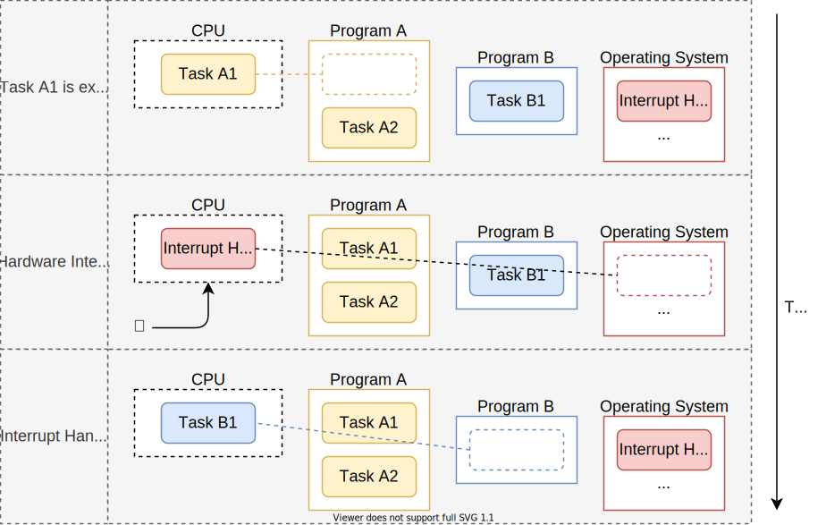
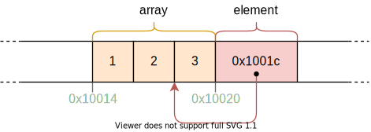

[toc]

在本文中我们将讨论协作式多任务和 Rust 中的 `async/await `特性，我们会详细了解 async/await 在 Rust 中是如何工作的，包括`Future` trait 的设计，状态机的转换和*pinning*。 然后，我们通过创建一个异步键盘任务和一个基本的执行器（executor），为我们的内核添加基本的 async/await 支持。

本文在[Github](http://link.zhihu.com/?target=https%3A//github.com/phil-opp/blog_os)上是公开的。如果你有任何问题，请在 Github 上提 issue。你还可以在底部留下评论，本文完整的源码可以在[post-12](http://link.zhihu.com/?target=https%3A//github.com/phil-opp/blog_os/tree/post-12)分支看到。

### 多任务

[多任务](http://link.zhihu.com/?target=https%3A//en.wikipedia.org/wiki/Computer_multitasking)是大多数操作系统的基本特征之一，指能够并发地执行多个任务。例如，你可能在阅读本文的同时还运行着一些其他的程序，比如一个文本编辑器或者终端窗口。即使你只开着一个浏览器窗口，依然还会有各种后台任务在运行，管理着你的桌面窗口，检查更新或者索引文件。

尽管看上去似乎所有的任务是以并行的方式在运行，但实际上 CPU 核心一次只能执行一个任务。为了营造任务并行运行的错觉，操作系统会在活动任务之间快速切换，使每个任务都能向前推进一点儿。因为计算机运行速度很快，所以在绝大多数时候我们都注意不到这些切换。

虽然单核 CPU 一次只能执行单个任务，但是多核 CPU 能够真正以并行的方式执行多任务。例如，一个 8 核心的 CPU 可以同时运行 8 个任务。我们会在以后的文章中介绍如何设置多核 CPU。在本文中，为简单起见，我们主要讨论单核 CPU。（值得注意的是，所有的多核 CPU 都是从一个单独的活动核心开始的，所以我们目前可以把它们视作单核 CPU。）

存在两种形式的多任务：协作式多任务（Cooperative multitasking）要求任务周期性地放弃对 CPU 的控制权从而使得其他任务可以向前推进。抢占式多任务（Preemptive multitasking）利用操作系统功能通过强制暂停任务从而在任意时间点进行任务切换。下面我们将更加详细地讨论这两种形式的多任务并分析它们各自的优缺点。

#### 抢占式多任务（Preemptive Multitasking）

抢占式多任务背后的理念是，操作系统控制了什么时间去切换任务。为此，它利用了每次中断时重新获得 CPU 控制这一事实。这样，只要系统有新的输入，就可以切换任务。例如，在鼠标移动或者网络包到达时它也可以切换任务。操作系统还可以通过配置一个硬件定时器在指定时间后发送中断，来决定一个任务被允许运行的准确时长。

下图解释了在一次硬件中断时的任务切换过程：



在第一行，CPU 正在执行程序（Program）`A`里的任务（Task）`A1`。所有其他的任务都是暂停的。在第二行，一个硬件中断抵达 CPU。正如[Hardware Interrupts](http://link.zhihu.com/?target=https%3A//os.phil-opp.com/hardware-interrupts/)这篇文章所描述的那样，CPU 立即停止了任务`A1`的执行并跳转到定义在中断向量表（ interrupt descriptor table ， IDT）中的中断处理程序（interrupt handler）。通过这个中断处理程序，操作系统现在再次控制了 CPU，从而使得它能够切换到任务`B1`而不是继续执行任务`A1`

##### 保存状态

因为任务会在任意时刻被中断，而此时它们可能正处于某些计算的中间阶段。为了能够在后面进行恢复，操作系统必须将任务的整个状态进行备份，包括它的[调用栈（call stack）](http://link.zhihu.com/?target=https%3A//en.wikipedia.org/wiki/Call_stack)以及所有的 CPU 寄存器的值。这个过程被称为[上下文切换（context switch）](http://link.zhihu.com/?target=https%3A//en.wikipedia.org/wiki/Context_switch)

因为调用栈可能非常大，操作系统通常会为每个任务设置一个单独的调用栈，而不是在每次任务切换时都备份调用栈。这样带有单独调用栈的一个任务被称为[执行线程（thread of execution）](http://link.zhihu.com/?target=https%3A//en.wikipedia.org/wiki/Thread_(computing%20%22%E6%89%A7%E8%A1%8C%E7%BA%BF%E7%A8%8B%EF%BC%88thread%20of%20execution%EF%BC%89%22))或者短线程（thread for short）。在为每个任务使用一个单独的调用栈之后，在上下文切换时就只需要保存寄存器里的内容（包括程序计数器和栈指针）。这种方式使得上下文切换的开销最小化，这是非常重要的，因为上下文切换每秒会发生 100 次。

##### 讨论

抢占式多任务的主要优势是操作系统可以完全控制一个任务的允许执行时间。这种方式下，它可以保证每个任务都获得一个公平的 CPU 时间片，而不需要依靠任务的协作。这在运行第三方任务或者多个用户共享一个系统时是尤其重要的。

抢占式多任务的缺点在于每个任务都需要自己的栈。相较于共享栈，这会导致每个任务更高的内存使用并且经常会限制系统中任务的数量。另一个缺点是操作系统在每一次任务切换时都必须要保存完整的 CPU 寄存器状态，即使任务可能只使用了寄存器的一小部分。

抢占式多任务和线程是一个操作系统的基础组件，因为它们使得运行不可靠的用户态程序成为可能。我们会在以后的文章中充分地讨论这些概念。但是在本文中，我们将主要讨论协作式多任务，它也为我们的内核提供了有用的功能。

#### 协作式多任务（Cooperative Multitasking）

协作式多任务通常被用于编程语言级别，例如以[协程（coroutine）](http://link.zhihu.com/?target=https%3A//en.wikipedia.org/wiki/Coroutine)或者[async/await](http://link.zhihu.com/?target=https%3A//rust-lang.github.io/async-book/01_getting_started/04_async_await_primer.html)的形式。它的思想是，程序员或者编译器在程序中插入[yield](http://link.zhihu.com/?target=https%3A//en.wikipedia.org/wiki/Yield_(multithreading%20%22yield%22))操作，yield 操作放弃 CPU 的控制并允许其他任务运行。例如，可以在一个复杂的循环每次迭代后插入一个 yield。

常见的是将协作式多任务和[异步操作（asynchronous operations）](http://link.zhihu.com/?target=https%3A//en.wikipedia.org/wiki/Asynchronous_I/O)相结合。不同于总是等待一个操作完成并且阻止其他任务这个时间运行，如果操作还没结束，异步操作返回一个“未准备好（not ready）”的状态。在这种情况下，处于等待中的任务可以执行一个 yield 操作让其他任务运行。

##### 保存状态
因为任务定义了它们自身的暂停点，所以它们不需要操作系统来保存它们的状态。它们可以在自己暂停之前，准确保存自己所需的状态以便之后继续执行，这通常会带来更好的性能。例如，刚刚结束一次复杂计算的任务可能只需要备份计算的最后结果，因为它不再需要任何中间过程的结果。语言支持的协作式多任务实现甚至能够在暂停之前备份调用栈中所需要的部分。例如，Rust 中的 async/await 实现存储了所有的局部变量（local variable），这些变量在一个自动生成的结构体中还会被用到（后面会提到）。通过在暂停之前备份调用栈中的相关部分，所有的任务可以共享一个调用栈 ，从而使得每个任务的内存消耗比较小。这也使得在不耗尽内存的情况下创建几乎任意数量的协作式任务成为可能。
##### 讨论
协作式多任务的缺点是，一个非协作式任务有可能无限期运行。因此，一个恶意或者有 bug 的任务可以阻止其他任务运行并且拖慢甚至锁住整个系统。因此，仅当所有的任务已知是都能协作的情况下，协作式多任务才应该被使用。举一个反例，让操作系统依赖于任意用户级程序的协作不是一个好的想法。

尽管如此，协作式多任务的强大性能和内存优势使得它依然成为在程序内使用的好方法，尤其是与异步操作相结合后。因为操作系统内核是一个与异步硬件交互的性能关键型（performance-critical）程序，所以协作式多任务似乎是实现并发的一种好方式

###  Async/Await in Rust

Rust 语言以 async/await 的形式对协作式多任务提供了最好的支持。在我们探讨 async/await 是什么以及它是怎样工作的之前，我们需要理解 future 和异步编程在 Rust 中是如何工作的。

#### Futures

Future 表示一个可能还无法获取到的值。例如由另一个任务计算的整数或者从网络上下载的文件。Future 不需要一直等待直到结果值变为可用，而是可以继续执行直到需要这个值的时候。
示例
下面这个例子可以很好的阐述 future 的概念


在这个时序图里，`main`函数从文件系统读取一个文件，然后调用函数`foo`。这个过程重复了两次：一次是调用同步的`read_file`，另一次是调用异步的`async_read_file`。

在同步调用的情况下，`main`需要等待文件从文件系统载入。然后它才可以调用`foo`函数，`foo`又需要再次等待结果。

在调用异步的`async_read_file`的情况下，文件系统直接返回一个 future 并且在后台异步地载入文件。这使得`main`函数得以更加容易地调用`foo`，`foo`与文件载入并行运行。在这个例子中，文件载入在`foo`返回之前就完成载入，所以`main`可以直接对文件操作而不必等待`foo`返回。

##### Futures in Rust

在 Rust 中，future 通过[Future](http://link.zhihu.com/?target=https%3A//doc.rust-lang.org/nightly/core/future/trait.Future.html) trait 来表示，它看起来像下面这样：

```rust
pub trait Future {
    type Output;
    fn poll(self: Pin<&mut Self>, cx: &mut Context) -> Poll<Self::Output>;
}
```

[关联类型](http://link.zhihu.com/?target=https%3A//doc.rust-lang.org/book/ch19-03-advanced-traits.html%23specifying-placeholder-types-in-trait-definitions-with-associated-types)`Output`指定了异步的值的类型。例如，上图中的`async_read_file`函数将会返回一个`Future`实例，其中`Output`类型被设置为`File`。

[poll](http://link.zhihu.com/?target=https%3A//doc.rust-lang.org/nightly/core/future/trait.Future.html%23tymethod.poll)能够检查是否值已经可用。它返回一个`Poll`枚举，看起来像下面这样：

```rust
pub enum Poll<T> {
    Ready(T),
    Pending,
}
```

当这个值可用时（例如，文件已经从磁盘上被完整地读取），该值会被包装在`Ready`变量中然后被返回。否则，会返回一个`Pending`变量，告诉调用者这个值目前还不可用。

`poll`方法接收两个参数：`self: Pin<&mut Self>` 和 `cx: &mut Context`。前者类似于一个普通的`&mut self`引用，不同的地方在于`Self`值被[pinned](http://link.zhihu.com/?target=https%3A//doc.rust-lang.org/nightly/core/pin/index.html)到它的内存位置。如果不理解 async/await 是如何工作的，就很难理解`Pin`以及为什么需要它。因此，我们稍后再来解释这个问题。

`cx: &mut Context`参数的目的是把一个`Waker`实例传递给异步任务，例如从文件系统载入文件。`Waker`允许异步任务发送通知表示任务（或任务的一部分）已经完成，例如文件已经从磁盘上载入。因为主任务知道当`Future`就绪的时候自己会被提醒，所以它不需要一次又一次地调用`poll`。在本文后面当我们实现自己的 Waker 类型时，我们将会更加详细地解释这个过程。

#### 使用 Future

现在我们知道 future 是如何被定义的并且理解了`poll`方法背后的基本思想。尽管如此，我们仍然不知道如何使用 future 来高效地工作。问题在于 future 表示异步任务的结果，而这个结果可能是不可用的。尽管如此，在实际中，我们经常需要这些值直接用于后面的计算。所以，问题是：我们怎样在我们需要时能够高效地取回一个 future 的值？

##### 等待 Future

一个答案是等待 future 就绪。看起来类似下面这样：

```rust
let future = async_read_file("foo.txt");
let file_content = loop {
    match future.poll(…) {
        Poll::Ready(value) => break value,
        Poll::Pending => {}, // do nothing
    }
}
```

在这段代码里，我们通过在循环里反复地调用`poll`来等待 future。这里`poll`的参数无关紧要，所以我们将其忽略。虽然这个方案能够工作，但是它非常低效，因为在该值可用之前 CPU 一直处于繁忙。

一个更加高效的方式是阻塞当前的线程直到 future 变为可用。当然这是在你有线程的情况下才有可能，所以这个解决方案对于我们的内核来讲不起作用，至少目前还不行。即使是在支持阻塞的系统上，这通常也是不希望发生的，因为它又一次地把一个异步任务转为了一个同步任务，从而抑制了并行任务潜在的性能优势。


##### Future组合器

等待的一个替换选项是使用 future 组合器。Future 组合子是类似`map`的方法，它们能够将 future 进行链接和组合，和`Iterator`上的方法比较相似。这些组合子不是在 future 上等待，而是自己返回一个 future，这个 future 在`poll`上进行了映射操作。

举个例子，一个简单的`string_len`组合子，用于把`Future<Output = String>`转换为`Future<Output = usize>`，可能看起来像下面这样：

```rust
struct StringLen<F> {
    inner_future: F,
}

impl<F> Future for StringLen<F> where F: Future<Output = String> {
    type Output = usize;

    fn poll(mut self: Pin<&mut Self>, cx: &mut Context<'_>) -> Poll<T> {
        match self.inner_future.poll(cx) {
            Poll::Ready(s) => Poll::Ready(s.len()),
            Poll::Pending => Poll::Pending,
        }
    }
}

fn string_len(string: impl Future<Output = String>)
    -> impl Future<Output = usize>
{
    StringLen {
        inner_future: string,
    }
}

// Usage
fn file_len() -> impl Future<Output = usize> {
    let file_content_future = async_read_file("foo.txt");
    string_len(file_content_future)
}
```

这段代码不能正常执行，因为它没有处理[pinning](http://link.zhihu.com/?target=https%3A//doc.rust-lang.org/stable/core/pin/index.html)，但是这里它作为一个例子已经足够了。基本的思想是，`string_len`函数把一个给定的`Future`实例包装进一个新的`StringLen`结构体，该结构体也实现了`Future`。当被包装的 Future 被轮询（poll）时，它轮询内部的 future。如果这个值尚未就绪，被包装的 future 也会返回`Poll::Pending`。如果这个值就绪，字符串会从`Poll::Ready`变量中导出并且它的长度会被计算出来。之后，它会再次被包装进`Poll::Ready`然后返回。 

通过`string_len`函数，我们可以在不必等待的情况下异步地计算一个字符串的长度。因为这个函数会再次返回一个`Future`，所以调用者无法直接在返回值上操作，而是需要再次使用组合子函数。通过这种方式，整个调用图就变成了异步的，并且我们可以在某个时间点高效地同时等待多个 future，例如在 main 函数中。

手动编写组合器函数是困难的，因此它们通常由库来提供。然而 Rust 标准库本身没有提供组合方法，但是半官方的（兼容`no_std`）`future` crate 提供了。它的`FutureExt` trait 提供了高级别的组合子方法，像`map`或者`then`，这些组合器方法可以被用于操作带有任意闭包的结果。

##### 优势

Future 组合器的最大优势在于，它们保持了操作的异步性。通过结合异步 I/O 接口，这种方式可以得到很高的性能。事实上，future 组合器被实现为带有 trait 实现的普通结构体，这使得编译器能够对它们进行极度优化。如果想了解更多的细节，可以阅读[Zero-cost futures in Rust](http://link.zhihu.com/?target=https%3A//aturon.github.io/blog/2016/08/11/futures/)这篇文章，该文宣布了 future 加入了 Rust 生态系统。

##### 缺点

尽管 future 组合子能够让我们写出非常高效的代码，但是在某些情况下由于类型系统和基于闭包的接口，使用它们也很困难。例如，考虑下面的代码：

```rust
fn example(min_len: usize) -> impl Future<Output = String> {
    async_read_file("foo.txt").then(move |content| {
        if content.len() < min_len {
            Either::Left(async_read_file("bar.txt").map(|s| content + &s))
        } else {
            Either::Right(future::ready(content))
        }
    })
}
```

在这里，我们读取文件`foo.txt`，接着使用`then`组合子基于文件内容链接第二个 future。如果内容长度小于给定的`min_len`，我们读取另一个文件`bar.txt`然后使用`map`组合子将其追加到`content`中。否则，我们就仅返回`foo.txt`的内容。

我们需要对传入`then`里的闭包使用`move`关键字，因为如果不这样做，将会出现一个关于`min_len`的生命中周期错误。使用`Either`包装器（wrapper）的原因是 if 和 else 语句块必须拥有相同的类型。因为我们在块中返回不同的 future 类型，所以我们必须使用包装器类型来把它们统一到相同类型。`ready`函数把一个值包装进一个立即就绪的 future。需要这个函数是因为`Either`包装器期望被包装的值实现了`Future`。

正如你所想，对于较大的项目，这样写很快就能产生非常复杂的代码。如果涉及到借用和不同的生命周期，它会变得更为复杂。为此，我们投入了大量的工作来为 Rust 添加对 async/await 的支持，就是为了让异步代码的编写从根本上变得更加简单。

#### Async/Await 模式

async/await 背后的思想是让程序员能够像写普通的同步代码那样来编写代码，由编译器负责将其转为异步代码。它基于`async`和`await`两个关键字来发挥作用。`async`关键字可以被用于一个函数签名，负责把一个同步函数转为一个返回 future 的异步函数。

```rust
async fn foo() -> u32 {
    0
}

// the above is roughly translated by the compiler to:
fn foo() -> impl Future<Output = u32> {
    future::ready(0)
}
```

这个关键字是无法单独发挥作用的，但是在`async`函数内部，`await`关键字可以被用于取回（retrieve）一个 future 的异步值。

```rust
async fn example(min_len: usize) -> String {
    let content = async_read_file("foo.txt").await;
    if content.len() < min_len {
        content + &async_read_file("bar.txt").await
    } else {
        content
    }
}
```

（[尝试在 playground 上运行这段代码](https://link.zhihu.com/?target=https%3A//play.rust-lang.org/%3Fversion%3Dstable%26mode%3Ddebug%26edition%3D2018%26gist%3Dd93c28509a1c67661f31ff820281d434)）

这个函数是对`example`函数的一个直接转换，`example`函数使用了上面提到的组合函数。通过使用`.await`操作，我们能够在不需要任何闭包或者`Either`的情况下检索一个 future 的值。因此，我们可以像写普通的同步代码一样来写我们的代码，不同之处在于我们写的仍然是异步代码。

##### 状态机转换

编译器在背后把`async`函数体转为一个[状态机（state machine)](https://link.zhihu.com/?target=https%3A//en.wikipedia.org/wiki/Finite-state_machine)，每一个`.await`调用表示一个不同的状态。对于上面的`example`函数，编译器创建了一个带有下面四种状态的状态机：


每个状态表示函数中一个不同的暂停点。"Start"和"End"状态表示开始执行的函数和执行结束的函数。"Waiting on foo.txt"状态表示函数当前正在等待第一个`async_read_file`的结果。类似地，"Waiting on bar.txt"表示函数正在等待第二个`async_read_file`结果。

这个状态机通过让每一次`poll`调用成为一次状态转换来实现`Future` trait。


上面这张图用箭头表示状态切换，用菱形表示分支路径。例如，如果`foo.txt`没有准备好，就会选择标记"no"的路径然后进入”Waiting on foo.txt“状态。否则，就会选择"yes"路径。中间较小的没有标题的红色菱形表示`example`函数的`if content.len() < 100`分支。

我们可以看到第一个`poll`调用启动了这个函数并使函数一直运行直到它到达一个尚未就绪的 future。如果这条路径上的所有 future 都已就绪，该函数就可以一直运行到"End"状态，这里它把自己的结果包装在`Poll::Ready`中然后返回。否则，状态机进入到一个等待状态并返回"Poll::Pending"。在下一个`poll`调用时，状态机从上次等待状态开始然后重试上次操作。

##### 保存状态

为了能够从上次等待状态继续下去，状态机必须在内部记录当前状态。此外，它还必须要保存下次poll调用时继续执行需要的所有变量。这也正是编译器大展身手的地方：因为编译器知道哪个变量在何时被使用，所以它可以自动生成结构体，这些结构体准确地包含了所需要的变量。
例如，编译器可以针对上面的example函数生成类似下面的结构体：

```rust
//  再次放上`example` 函数 ，你就不用去上面找它了
async fn example(min_len: usize) -> String {
    let content = async_read_file("foo.txt").await;
    if content.len() < min_len {
        content + &async_read_file("bar.txt").await
    } else {
        content
    }
}

// 编译器生成的状态结构体:

struct StartState {
    min_len: usize,
}

struct WaitingOnFooTxtState {
    min_len: usize,
    foo_txt_future: impl Future<Output = String>,
}

struct WaitingOnBarTxtState {
    content: String,
    bar_txt_future: impl Future<Output = String>,
}

struct EndState {}
```

在"Start"和"Waiting on foo.txt"这两个状态（分别对应 StartState 和 WaitingOnFooTxtState 结构体）里，参数`min_len`需要被存储起来，因为在后面和`content.len()`进行比较时会需要用到它。"Waiting on foo.txt"状态还需要额外存储一个`foo_txt_future`，它表示由`async_read_file`调用返回的 future。这个 future 在当状态机继续的时候会被再次轮询（poll），所以它也需要被保存起来。

"Waiting on bar.txt"状态（译注：对应`WaitingOnBarTxtState` 结构体）包含了`content`变量，因为它会在`bar.txt`就绪后被用于字符串拼接。该状态还存储了一个`bar_txt_future`用以表示对`bar.txt`正在进行的加载。`WaitingOnBarTxtState`结构体不包含`min_len`变量因为它在和 `content.len()`比较后就不再被需要了。在"End"状态下，没有存储任何变量，因为函数在这里已经运行完成。

注意，这里只是编译器针对代码可能生成的一个示例。结构体的命名以及字段的布局都是实现细节并且可能有所不同。

##### 完整的状态机类型

虽然具体的编译器生成代码是一个实现细节，但是它有助于我们理解`example`函数生成的状态机看起来是怎么样的？我们已经定义了表示不同状态的结构体并且包含需要的字段。为了能够在此基础上创建一个状态机，我们可以把它组合进`enum`：

```rust
enum ExampleStateMachine {
    Start(StartState),
    WaitingOnFooTxt(WaitingOnFooTxtState),
    WaitingOnBarTxt(WaitingOnBarTxtState),
    End(EndState),
}
```

我们为每个状态定义一个单独的枚举变量，并且把对应的状态结构体添加到每个变量中作为一个字段。为了实现状态转换，编译器基于`example`函数生成了一个`Future` trait 的实现：

```rust
impl Future for ExampleStateMachine {
    type Output = String; // return type of `example`

    fn poll(self: Pin<&mut Self>, cx: &mut Context) -> Poll<Self::Output> {
        loop {
            match self { // TODO: handle pinning
                ExampleStateMachine::Start(state) => {…}
                ExampleStateMachine::WaitingOnFooTxt(state) => {…}
                ExampleStateMachine::WaitingOnBarTxt(state) => {…}
                ExampleStateMachine::End(state) => {…}
            }
        }
    }
}
```

future 的`Output`类型是`String`，因为它是`example`函数的返回类型。为了实现`poll`函数，我们在`loop`内部对当前的状态使用一个 match 语句。其思想在于只要有可能就切换到下一个状态，当无法继续的时候就使用一个显式的`return Poll::Pending`。

简单起见，我们只能展示简化的代码且不对[pinning](https://link.zhihu.com/?target=https%3A//doc.rust-lang.org/stable/core/pin/index.html)、所有权、生命周期等进行处理。所以，这段代码以及接下来的代码就当成是伪代码，不要直接使用。当然，实际上编译器生成的代码已经正确地处理好了一切，尽管可能是以另一种方式。

为了让代码片段尽可能地小，我们为每个 match 分支单独展示代码。让我们先从`Start`状态开始:

```rust
ExampleStateMachine::Start(state) => {
    // from body of `example`
    let foo_txt_future = async_read_file("foo.txt");
    // `.await` operation
    let state = WaitingOnFooTxtState {
        min_len: state.min_len,
        foo_txt_future,
    };
    *self = ExampleStateMachine::WaitingOnFooTxt(state);
}
```

状态机在函数开始时就处于`Start`状态，在这种情况下，我们从`example`函数体执行所有的代码，直至遇到第一个`.await`。为了处理`.await`操作，我们把`self`状态机的状态更改为`WaitingOnFooTxt`，包括了对`WaitingOnFooTxtState`的构造。

因为`match self {...}` 状态是在一个循环里执行的，这个执行接下来跳转到`WaitingOnFooTxt`分支：

```rust
ExampleStateMachine::WaitingOnFooTxt(state) => {
    match state.foo_txt_future.poll(cx) {
        Poll::Pending => return Poll::Pending,
        Poll::Ready(content) => {
            // from body of `example`
            if content.len() < state.min_len {
                let bar_txt_future = async_read_file("bar.txt");
                // `.await` operation
                let state = WaitingOnBarTxtState {
                    content,
                    bar_txt_future,
                };
                *self = ExampleStateMachine::WaitingOnBarTxt(state);
            } else {
                *self = ExampleStateMachine::End(EndState));
                return Poll::Ready(content);
            }
        }
    }
}
```

在这个 match 分支，我们首先调用`foo_txt_future`的`poll`函数。如果它尚未就绪，我们就退出循环然后返回`Poll::Pending`。因为这种情况下`self`仍处于`WaitingOnFooTxt`状态，下一次的`poll`调用将会进入到相同的 match 分支然后重试对`foo_txt_future`轮询。

当`foo_txt_future`就绪后，我们把结果赋予`content`变量并且继续执行`example`函数的代码：如果`content.len()`小于保存在状态结构体里的`min_len`，`bar.txt`文件会被异步地读取。我们再次把`.await`操作转换为一个状态改变，这次改变为`WaitingOnBarTxt`状态。因为我们在一个循环里面正在执行`match`，执行流程直接跳转到新的状态对应的 match 分支，这个新分支对`bar_txt_future`进行了轮询。

一旦我们进入到`else`分支，后面就不再会进行`.await`操作。我们到达了函数结尾并返回包装在`Poll::Ready`中的`content`。我们还把当前的状态改为了`End`状态。

`WaitingOnBarTxt`状态的代码看起来像下面这样：

```rust
ExampleStateMachine::WaitingOnBarTxt(state) => {
    match state.bar_txt_future.poll(cx) {
        Poll::Pending => return Poll::Pending,
        Poll::Ready(bar_txt) => {
            *self = ExampleStateMachine::End(EndState));
            // from body of `example`
            return Poll::Ready(state.content + &bar_txt);
        }
    }
}
```

与`WaitingOnFooTxt`状态类似，我们从轮询`bar_txt_future`开始。如果它仍然是 pending，我们退出循环然后返回`Poll::Pending`。否则，我们可以执行`example`函数最后的操作：将来自 future 的结果与`content`相连接。我们把状态机更新到`End`状态，然后将结果包装在`Poll::Ready`中进行返回。

最后，`End`状态的代码看起来像下面这样：

```rust
ExampleStateMachine::End(_) => {
    panic!("poll called after Poll::Ready was returned");
}
```

在返回`Poll::Ready`之后，future 不应该被再次轮询。因此，当我们已经处于`End`状态时，如果`poll`被调用我们将会 panic。

我们现在知道编译器生成的状态机以及它对`Future` trait 的实现是什么样子的了。实际上，编译器是以一种不同的方式来生成代码。（如果你感兴趣的话，当前的实现是基于[生成器（generator）](https://link.zhihu.com/?target=https%3A//doc.rust-lang.org/nightly/unstable-book/language-features/generators.html)的，但是这只是一个实现细节）。

最后一部分是生成的示例函数本身的代码。记住，函数签名是这样定义的：

```rust
async fn example(min_len: usize) -> String

```

因为完整的函数体实现是通过状态机来实现的，这个函数唯一需要做的事情是初始化状态机并将其返回。生成的代码看起来像下面这样：

```rust
fn example(min_len: usize) -> ExampleStateMachine {
    ExampleStateMachine::Start(StartState {
        min_len,
    })
}
```

这个函数不再有`async`修饰符，因为它现在显式地返回一个`ExampleStateMachine`类型，这个类型实现了`Future` trait。正如所期望的，状态机在`Start`状态被构造，并使用`min_len`参数初始化与之对应的状态结构体。

记住，这个函数没有开始状态机的执行。这是 Rust 中 future 的一个基本设计决定：在第一次轮询之前，它们什么都不做。

#### Pin

在本文中我们已经与`pinning`偶遇多次。现在终于可以来讨论`pinning`是什么以及为什么需要它？

##### 自引用结构体（Self-Referential Structs）

正如上面所解释的，状态机的变换把每个暂停点的局部变量存储在一个结构体中。对于像`example`函数这样的小例子，这会很直观且不会导致什么问题。但是，当变量开始互相引用时，事情就变得困难了。例如，考虑下面的函数：

```rust
async fn pin_example() -> i32 {
    let array = [1, 2, 3];
    let element = &array[2];
    async_write_file("foo.txt", element.to_string()).await;
    *element
}
```

这个函数创建了一个`array`，其中包含有`1`，`2`，`3`。它接着创建了一个对 `array` 最后一个元素的引用然后把它存入`element`变量。接下来，它把这个已经转换为字符串的数字异步地写入到文件`foo.txt`中。最后，它返回了被`element`引用的数字。

因为这个函数使用了一个的`await`操作，所以得到的状态机有三种状态：启动（start）、结束（end）和等待写入（waiting on write）。这个函数没有传入参数，所以开始状态的结构体是空的。和之前一样，结束状态也是空的因为函数在这个位置已经结束了。等待写入状态的结构体就比较有意思了：

```rust
struct WaitingOnWriteState {
    array: [1, 2, 3],
    element: 0x1001c, // address of the last array element
}
```

我们需要把`array`和`element`变量都存储起来，因为`element`在返回值的时候需要，而`array`被`element`所引用。`element`是一个引用，它存储了一个指向被引用元素的指针（也就是一个内存地址）。这里我们假设地址是`0x1001c`，在实际中，它需要是`array`的最后一个元素的地址，因此，它取决于结构体在内存中所处的位置。带有这样的内部指针的结构体被称为`自引用（self-referential）结构体`，因为它们通过自己的一个字段引用了它们自身。

##### 自引用结构体的问题

我们的自引用结构体的内部指针导致了一个基本问题，当我们看到它的内存布局后，这个问题就会变得明显：



`array`字段的起始地址为`0x10014`，`element`字段在地址`0x10020`。它指向了地址`0x1001c`，因为 `array` 的最后一个元素的位置就在这里。此时，一切都没有问题。但是，当我们试图把这个结构体移动到一个不同的内存地址时，问题就出现了：


我们把结构体往后移动了一下，因此现在它的起始地址为`0x10024`。当我们把结构体作为函数参数传递时或者把它赋值给另一个栈上的变量，就会发生这种情况。问题在于，`element`字段仍然指向地址`0x1001c`，而`array`的最后一个元素的地址已经变成`0x1002c`。因此，这个指针是悬垂（dangling）的，并会导致下一次调用`poll`时发生未定义行为。


##### 可能的解决方案

解决这个悬垂指针问题有三种基本方式：

-  在移动时更新指针：思路是无论什么时候，只要结构体在内存中被移动，就更新内部的指针，因此这个指针在移动后仍然是有效的。不幸的是，这种方式将会需要 Rust 作出很大的改变并且有可能导致巨大的性能开销。原因是，运行时需要追踪所有结构体字段的类型并且在每次移动操作时都要检查是否需要更新指针。
   
-  存储一个偏移量来取代自引用：为了避免更新指针的需要，编译器可以把自引用存储为个结构体开始位置的偏移量。例如，上面的`WaitingOnWriteState`结构体中的`element`字段可以存储为值为 8 的`element_offset`字段。因为，引用指向的 array 里的元素起始于结构体开头的 8 字节。因为偏移位置在结构体移动时是不变的，所以不需要进行字段更新。

  这种方式的问题在于它需要编译器去探查所有的自引用。这在编译时是不可能实现的，因为一个引用的值可能取决于用户输入，因此，我们可能再次需要一个运行时系统来分析引用并正确地创建状态结构体。这不会导致运行时开销，但是也阻碍了特定的编译器优化，因此，它可能会再度引起巨大的性能开销。
  
-  禁止移动结构体：正如我们上面所见，悬垂指针仅发生于我们在内存中移动结构体时，通过完全禁止在自引用结构体上的移动操作，可以避免这个问题。这种方式的一个显著优势在于，它可以在类型系统层面上被实现而不需要额外的运行时开销。缺点在于，它把处理可能是自引用结构的移动操作的负担交给了程序员。
   

因为要保证提供零成本抽象（zero cost abstraction）的原则，这意味着抽象不应该引入额外的运行时开销，所以 Rust 选择了第三种方案。也因此，[pinning](http://link.zhihu.com/?target=https%3A//doc.rust-lang.org/stable/core/pin/index.html)API 在[RFC2349](http://link.zhihu.com/?target=https%3A//github.com/rust-lang/rfcs/blob/master/text/2349-pin.md)中被提出。接下来，我们将会对这个 API 进行简要介绍，并解释它是如何与 async/await 以及 future 一同工作的。

#####  堆上的值（Heap Values）

第一个发现是，在大多数情况下，[堆分配（heap allocated）](http://link.zhihu.com/?target=https%3A//os.phil-opp.com/heap-allocation/)的值已经在内存中有了一个固定地址。它们通过调用`allocate`来创建，然后被一个指针类型引用，比如`Box<T>`。尽管指针类型有可能被移动，但是指针指向的堆上的值仍然保持在相同的内存地址，除非它被一个`deallocate`调用来释放。

使用堆分配，我们可以尝试去创建一个自引用结构体：

```RUST
fn main() {
    let mut heap_value = Box::new(SelfReferential {
        self_ptr: 0 as *const _,
    });
    let ptr = &*heap_value as *const SelfReferential;
    heap_value.self_ptr = ptr;
    println!("heap value at: {:p}", heap_value);
    println!("internal reference: {:p}", heap_value.self_ptr);
}

struct SelfReferential {
    self_ptr: *const Self,
}
```

（[在 playground 上运行代码](http://link.zhihu.com/?target=https%3A//play.rust-lang.org/%3Fversion%3Dstable%26mode%3Ddebug%26edition%3D2018%26gist%3Dce1aff3a37fcc1c8188eeaf0f39c97e8)）

我们创建了一个名为`SelfReferential`的简单结构体，该结构体仅包含一个单独的指针字段。首先，我们使用一个空指针来初始化这个结构体，然后使用`Box::new`在堆上分配它。接着，我们计算出这个分配在堆上的结构体的内存地址并将其存储到一个`ptr`变量中。最后，我们通过把`ptr`变量赋值给`self_ptr`字段使得结构体成为自引用的。

当我们在 playground 上执行这段代码时，我们看到这个堆上的值的地址和它的内部指针的地址是相等的，这意味着，`self_ptr`字段是一个有效的自引用。因为`heap_value`只是一个指针，移动它（比如，把它作为参数传入函数）不会改变结构体自身的值，所以`self_ptr`在指针移动后依然是有效的。

但是，仍然有一种方式来破坏这个示例：我们可以摆脱`Box<T>`或者替换它的内容：

```RUST
let stack_value = mem::replace(&mut *heap_value, SelfReferential {
    self_ptr: 0 as *const _,
});
println!("value at: {:p}", &stack_value);
println!("internal reference: {:p}", stack_value.self_ptr);
```

（[在 playground 上运行](http://link.zhihu.com/?target=https%3A//play.rust-lang.org/%3Fversion%3Dstable%26mode%3Ddebug%26edition%3D2018%26gist%3De160ee8a64cba4cebc1c0473dcecb7c8)）

这里，我们使用`mem::replace`函数使用一个新的结构体实例来替换堆分配的值。这使得我们把原始的`heap_value`移动到栈上，而结构体的`self_ptr`字段现在是一个仍然指向旧的堆地址的悬垂指针。当你尝试在 playground 上运行这个示例时，你会看到打印出的`"value at:"`和`"internal reference:"`这一行确实是输出的不同的指针。因此，在堆上分配一个值并不能保证自引用的安全。

出现上面的破绽的基本问题是，`Box<T>`允许我们获得堆分配值的`&mut T`引用。这个`&mut`引用让使用类似`mem::replace`或者`mem::swap`的方法使得堆上值失效成为可能。为了解决这个问题，我们必须阻止创建对自引用结构体的`&mut`引用。

##### `Pin<Box<T>>` and `Unpin`

pinning API 以`Pin`包装类型和`Unpin`标记 trait 的形式提供了一个针对`&mut T`问题的解决方案。这些类型背后的思想是对`Pin`的包装的值的`&mut`引用的方法进行管控。`Unpin` trait 是一个[auto trait](http://link.zhihu.com/?target=https%3A//doc.rust-lang.org/reference/special-types-and-traits.html%23auto-traits)，它会为所有的类型自动实现，除了显式选择退出（opt-out）的类型。通过让自引用结构体选择退出`Unpin`，就没有（安全的）办法从一个`Pin<Box<T>>`类型获取一个`&mut T`。因此，它们的内部的自引用就能保证仍是有效的。

举个例子，让我们修改上面的`SelfReferential`类型来选择退出`Unpin`：

```rust
use core::marker::PhantomPinned;

struct SelfReferential {
    self_ptr: *const Self,
    _pin: PhantomPinned,
}
```

我们通过添加一个类型为[PhantomPinned](http://link.zhihu.com/?target=https%3A//doc.rust-lang.org/nightly/core/marker/struct.PhantomPinned.html)的`_pin`字段来选择退出。这个类型是一个零大小标记类型，它唯一目的就是不去实现`Unpin` trait。因为 auto trait 的工作方式，有一个字段不满足`Unpin`，那么整个结构体都会选择退出`Unpin`。

第二步是把例子中的`Box<SelfReferential>`改为`Pin<Box<SelfReferential>>`类型。实现这个的最简单的方式是使用`Box::pin`函数，而不是使用`Box::new`创建堆分配的值。

```rust
let mut heap_value = Box::pin(SelfReferential {
    self_ptr: 0 as *const _,
    _pin: PhantomPinned,
});
```

除了把`Box::new`改为`Box::pin`之外，我们还需要在结构体初始化添加新的`_pin`字段。因为`PhantomPinned`是一个零大小类型，我们只需要它的类型名来初始化它。

当我们尝试运行调整后的示例时，我们看到它无法编译：

作者：Praying
链接：https://zhuanlan.zhihu.com/p/348648305
来源：知乎
著作权归作者所有。商业转载请联系作者获得授权，非商业转载请注明出处。


```text
error[E0594]: cannot assign to data in a dereference of `std::pin::Pin<std::boxed::Box<SelfReferential>>`
  --> src/main.rs:10:5
   |
10 |     heap_value.self_ptr = ptr;
   |     ^^^^^^^^^^^^^^^^^^^^^^^^^ cannot assign
   |
   = help: trait `DerefMut` is required to modify through a dereference, but it is not implemented for `std::pin::Pin<std::boxed::Box<SelfReferential>>`

error[E0596]: cannot borrow data in a dereference of `std::pin::Pin<std::boxed::Box<SelfReferential>>` as mutable
  --> src/main.rs:16:36
   |
16 |     let stack_value = mem::replace(&mut *heap_value, SelfReferential {
   |                                    ^^^^^^^^^^^^^^^^ cannot borrow as mutable
   |
   = help: trait `DerefMut` is required to modify through a dereference, but it is not implemented for `std::pin::Pin<std::boxed::Box<SelfReferential>>`
```

两个错误发生都是因为`Pin<Box<SelfReferential>>`类型没有实现`DerefMut` trait。这也正是我们想要的，因为`DerefMut` trait 将会返回一个`&mut`引用，这是我们想要避免的。发生这种情况是因为我们选择退出了`Unpin`并把`Box::new`改为了`Box::pin`。

现在的问题在于，编译器不仅阻止了第 16 行的移动类型，还禁止了第 10 行的`self_ptr`的初始化。这会发生时因为编译器无法区分`&mut`引用的有效使用和无效使用。为了能够正常初始化，我们不得不使用不安全的[get_unchecked_mut](http://link.zhihu.com/?target=https%3A//doc.rust-lang.org/nightly/core/pin/struct.Pin.html%23method.get_unchecked_mut)方法：

```rust
// safe because modifying a field doesn't move the whole struct
unsafe {
    let mut_ref = Pin::as_mut(&mut heap_value);
    Pin::get_unchecked_mut(mut_ref).self_ptr = ptr;
}
```

（[尝试在 playground 上运行](http://link.zhihu.com/?target=https%3A//play.rust-lang.org/%3Fversion%3Dstable%26mode%3Ddebug%26edition%3D2018%26gist%3Db9ebbb11429d9d79b3f9fffe819e2018)）

[get_unchecked_mut](http://link.zhihu.com/?target=https%3A//doc.rust-lang.org/nightly/core/pin/struct.Pin.html%23method.get_unchecked_mut)函数作用于`Pin<&mut T>`而不是`Pin<Box<T>>`，所以我们不得不使用`Pin::as_mut`来对之前的值进行转换。接着，我们可以使用`get_unchecked_mut`返回的`&mut`引用来设置`self_ptr`字段。

现在，生下来的唯一的错误是`mem::replace`上的期望错误。记住，这个操作试图把一个堆分配的值移动到栈上，这将会破坏存储在`self_ptr`字段上的自引用。通过选择退出`Unpin`和使用`Pin<Box<T>>`，我们可以在编译期阻止这个操作，从而安全地使用自引用结构体。正如我们所见，编译器无法证明自引用的创建是安全的，因此我们需要使用一个不安全的块（block）并且确认其自身的正确性。


##### 栈 Pinning 和 Pin<&mut T>

在先前的部分，我们学习了如何使用`Pin<Box<T>>`来安全地创建一个堆分配的自引用的值。尽管这种方式能够很好地工作并且相对安全（除了不安全的构造），但是需要的堆分配也会带来性能损耗。因为 Rust 一直想要尽可能地提供零成本抽象， 所以 pinning API 也允许去创建`Pin<&mut T>`实例指向栈分配的值。

不像`Pin<Box<T>>` 实例那样能够拥有被包装的值的所有权，`Pin<&mut T>`实例只是暂时地借用被包装的值。这使得事情变得更加复杂，因为它要求程序员自己确认额外的保证。最重要的是，一个`Pin<&mut T>` 必须在被引用的`T`的整个生命周期被保持 pinned，这对于栈上的变量很难确认。为了帮助处理这类问题，就有了像[pin-utils](http://link.zhihu.com/?target=https%3A//docs.rs/pin-utils/0.1.0-alpha.4/pin_utils/)这样的 crate。但是我仍然不会推荐 pinning 到栈上除非你真的知道自己在做什么。

想要更加深入地了解，请查阅[pin 模块](http://link.zhihu.com/?target=https%3A//doc.rust-lang.org/nightly/core/pin/index.html)和[Pin::new_unchecked](http://link.zhihu.com/?target=https%3A//doc.rust-lang.org/nightly/core/pin/struct.Pin.html%23method.new_unchecked)方法的文档。

##### Pinning 和 Futures

正如我们在本文中已经看到的，[Future::poll](http://link.zhihu.com/?target=https%3A//doc.rust-lang.org/nightly/core/future/trait.Future.html%23tymethod.poll)方法以`Pin<&mut Self>`参数的形式来使用 pinning:

```rust
fn poll(self: Pin<&mut Self>, cx: &mut Context) -> Poll<Self::Output>
```

这个方法接收`self: Pin<&mut Self>`而不是普通的`&mut self`，其原因在于，从 async/await 创建的 future 实例常常是自引用的。通过把`Self`包装进`Pin`并让编译器为由 async/await 生的自引用的 futures 选择退出`Unpin`，可以保证这些 futures 在`poll`调用之间在内存中不被移动。这就保证了所有的内部引用都是仍然有效的。

值得注意的是，在第一次`poll`调用之前移动 future 是没问题的。因为事实上 future 是懒惰的（lazy）并且直到它们被第一次轮询之前什么事情也不会做。生成的状态机中的`start`状态因此只包含函数参数，而没有内部引用。为了调用`poll`，调用者必须首先把 future 包装进`Pin`，这就保证了 future 在内存中不会再被移动。因为栈上的 pinning 难以正确操作，所以我推荐一直使用`Box::pin`组合`Pin::as_mut`。

如果你想了解如何安全地使用栈 pinning 实现一个 future 组合字函数，可以去看一下[map 组合子方法的源码](http://link.zhihu.com/?target=https%3A//docs.rs/futures-util/0.3.4/src/futures_util/future/future/map.rs.html)，以及 pin 文档中的[ projections and structural pinning](http://link.zhihu.com/?target=https%3A//doc.rust-lang.org/stable/std/pin/index.html%23projections-and-structural-pinning)部分

#### Executors and Wakers

使用 async/await，可以让我们以一种全完异步的方式来与 future 进行更为自然地协作。然而，正如我们之前所了解到的，future 在被轮询之前什么事也不会做。这意味着我们必须在某个时间点上调用`poll`，否则异步的代码永远都不会执行。

对于单个的 future，我们总是通过使用一个循环手动地等待每个 future。但这种方式十分地低效，且对于一个创建大量 future 的程序来讲也不适用。针对这个问题的最常见的解决方式是定义一个全局的`executor`

##### Executors
executor 的作用在于能够产生 future 作为独立的任务，通常是通过某种spawn方法。接着 executor 负责轮询所有的 future 直到它们完成。集中管理所有的 future 的巨大优势在于，只要当一个 future 返回Poll::Pending时，executor 就可以切换到另一个 future。因此，异步操作可以并行执行并且 CPU 始终保存繁忙。许多 executor 的实现充分利用 CPU 多核心的优势，它们创建了一个线程池，该线程池能够在工作足够多的情况下充分利用所有的核心，并且使用类似work stealing的方式在核心之间进行负载均衡。还有针对嵌入式系统优化了低延迟和内存负载的特殊的 executor 实现。为了避免重复轮询 future 的负担，executor 通常会充分利用由 Rust 的 future 支持的 waker API。

##### Waker
WakerWaker API 背后的设计理念是，一个特定的Waker类型，包装在Context类型中，被传递到每一次poll执行。这个Waker类型由 executor 创建，并且可以被异步任务用来通知自己的部分完成。因此，executor 不需要在一个 future 返回Poll::Pending之前对其调用poll，直到它被对应的 waker 调用。这可以通过一个小例子来阐述：
```rust
async fn write_file() {
    async_write_file("foo.txt", "Hello").await;
}
```
这个函数异步地把一个字符串“Hello”写入到文件foo.txt中。因为硬盘写入需要一点儿时间，所以 future 上的第一次poll调用很大可能返回Poll::Pending。尽管如此，硬盘驱动将把传递给poll调用的Waker存储起来，并在当文件被完全写入磁盘后使用它来提醒 executor，通过这种方式，executor 在收到 waker 提醒之前不需要浪费时间一次又一次地去轮询这个 future。当我们在后面的章节实现自己的支持 waker 的 executor 时，我们就会看到Waker类型更详细的工作原理。

#### 协作式多任务？

在本文（系列）开头，我们讨论了抢占式和协作式多任务。抢占式多任务依赖于操作系统在运行中的任务间进行强制切换，协作式多任务则需要任务通过一个`yield`操作自愿放弃对 CPU 的控制权。协作式多任务的巨大优势在于，任务可以自己保存自身状态，从而产生更为高效的上下文切换，并使得在任务间共享相同的调用栈成为可能。

虽然看上去可能不太明显，但是 future 和 async/await 是一种协作式多任务模式的实现：

-  每个被添加到 executor 的 future 是一个协作式任务。
   
-  不同于显式的`yield`操作，future 通过返回`Poll::Pending`（或者是结束时的`Poll::Ready`）来放弃对 CPU 核心的控制权。
   
-  没有什么可以强制让 future 放弃 CPU，future 可以永远不从`poll`里面返回，例如，无限循环。
   
-  因为每个 future 都能阻塞 executor 中其他 future 的执行，所以我们需要确信它们不是恶意的。
   
-  Futures 内部存储了需要在下次`poll`调用继续执行所需的所有状态。通过 async/await，编译器会自动探测所有需要的变量并将其存储在生成的状态机内部。
   
- 只保存继续执行需要的最小状态
- 因为`poll`方法在返回时放弃了调用栈，所以同一个栈可以被用于轮询其他的 future。

我们可以看到，future 和 async/await 完美契合协作式多任务模式，它们只是用了一些不同的技术。接下来，我们将会交替使用“任务（task）”和“future”。